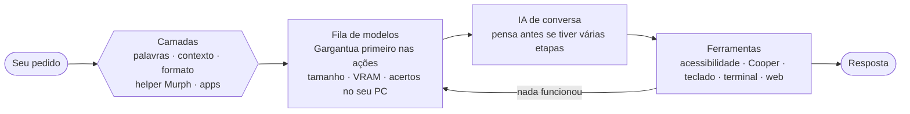
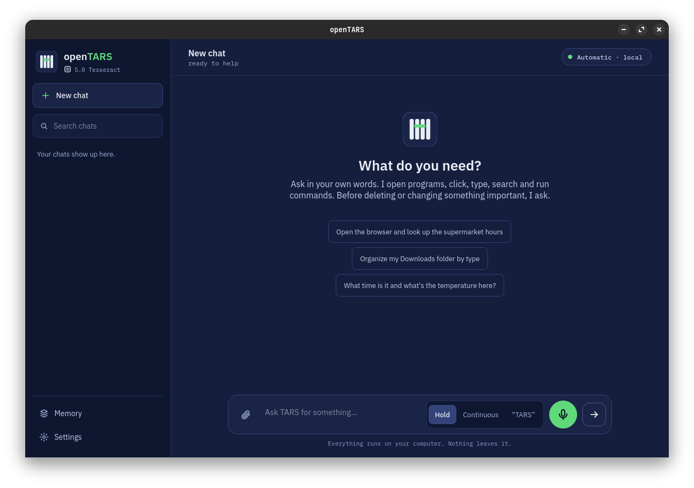
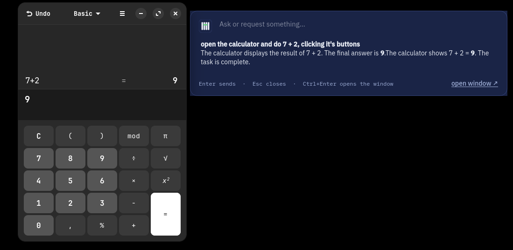

<div align="center">


# openTARS

**O assistente de IA local pro Linux, agora com uma IA treinada só pra ele.**

Você pede do seu jeito. Ele abre programas, clica nos botões pelo nome, digita, pesquisa, olha a tela e roda comandos.<br>
Tudo na sua máquina, via Ollama: sem nuvem, sem conta, sem mensalidade.<br>
**5.0 Tesseract:** a janela nova, em Qt: primeiro uso, conversa, voz, memória visível e nuvem opcional. Por baixo, segue a base leve da 4.6: só o Ollama, e o **Cooper** como único modelo que olha a tela. O **Gargantua** continua sendo a IA oficial.

[](#instalação)
[](#gargantua-a-ia-oficial)
[](LICENSE)
[](#compatibilidade)
[](https://ollama.com)
[](#idiomas)
[](https://www.instagram.com/open.tars/)

[Novidades da 5.0](#novidades-da-50-tesseract) · [4.6](#novidades-da-46-endurance) · [Instalar](#instalação) · [Gargantua](#gargantua-a-ia-oficial) · [Treinar o seu](gargantua/TUTORIAL.md) · [Como funciona](#como-funciona) · [Usar](#uso) · [Idiomas](#idiomas) · [Problemas comuns](#problemas-comuns) · [Instagram](https://www.instagram.com/open.tars/)

<br>


<sub>As imagens mostram a janela e a calculadora de verdade; nelas, as respostas do modelo foram roteirizadas pra demonstração.</sub><br>
<sub>🇺🇸 <i>English:</i> openTARS is a 100% local AI assistant for Linux. The interface speaks English too — pick it in the language menu. Its official AI is Gargantua (`ollama pull ProjectOpenTARS/Gargantua`).</sub>

</div>

<br>

## Por que o openTARS

<table>
<tr>
<td width="50%" valign="top">

### Tem a própria IA
O **Gargantua** foi treinado com milhares de pedidos resolvidos de verdade no openTARS, conferidos um a um. Ele já sabe as ferramentas: abre, clica, calcula e cria arquivos de primeira, rápido, numa placa de 6 GB.

</td>
<td width="50%" valign="top">

### Escolhe a IA sozinho
Várias camadas leem cada pedido em milissegundos, sem gastar IA nenhuma, e mandam pro modelo mais adequado entre os que você já tem: o que enxerga a tela, o de programação, o geral ou o mais rápido. E só liga o "raciocínio" quando ele ajuda: abrir e fechar programas sai na hora.

</td>
</tr>
<tr>
<td width="50%" valign="top">

### Clica pelo nome, não pela posição
Ele aperta os botões pelo texto que aparece neles ("7", "=", "Salvar"), pela acessibilidade do Linux: sem print, sem coordenada, em milissegundos, até no Wayland. O print continua como plano B.

</td>
<td width="50%" valign="top">

### Fica no seu PC
Nada do que você digita ou mostra sai da sua máquina. Comandos perigosos pedem confirmação, e ele nunca fecha um programa com trabalho não salvo.

</td>
</tr>
</table>

## Novidades da 5.0 Tesseract

A 5.0 troca a janela por uma nova, feita em **Qt (PySide6)**, igual ao desenho aprovado. Por baixo, o núcleo é o da 4.6 (só o Ollama, Cooper olhando a tela) com a **voz**, os **anexos** e a **nuvem opcional** de volta.

| | |
|---|---|
| 🧭 **Primeiro uso** | 5 passos: idioma, Ollama, nuvem (opcional), baixar o Gargantua e um teste rápido. Procura o Ollama, instala se faltar (pede a senha do sistema), baixa o modelo com barra de progresso (dá pra pausar e retomar) e confere com uma conta simples |
| 💬 **Janela principal** | Barra lateral com o **histórico por dia** (busca, apagar, abrir devolve o contexto exato à IA), pílula do modelo (Automático, locais ou nuvem), botão **Parar**, balões, raciocínio recolhido, ferramentas com tempo e avisos. Atalhos: `Ctrl+N` nova conversa, `Ctrl+K` buscar, `Ctrl+,` configurações, `Ctrl+M` microfone, `Esc` para |
| ✅ **Lista de etapas** | Em tarefas longas, o cartão **Etapas** mostra o que falta; cada ação concluída marca uma etapa (é uma aproximação: olhar a tela não conta) e no fim tudo fecha. Quando precisa de você, aparece "espera por você" |
| 🛡️ **Pergunta antes de ação arriscada** | Comando perigoso vira um cartão com **Permitir** / **Negar** (mostra 3 linhas e "Ver tudo"). Parar também nega o que estava esperando |
| 🎙️ **Voz com 3 modos** | **Segurar** para falar, **Contínua** e palavra **"TARS"**, tudo local (faster-whisper + Kokoro). Português e inglês (a voz em português é menos natural que a em inglês). Tela de voz com ondas, "você disse", silenciar e parar. Sem a voz instalada, o microfone leva a **Configurações → Voz** para instalar |
| 📎 **Anexos** | Clipe ou arrastar arquivos para a janela; texto e imagem (só para modelo que enxerga) |
| 🧠 **Memória visível** | **Configurações → Memória e privacidade** lista o que o TARS lembra, esquece item a item, exporta as conversas e apaga histórico/memória (com confirmação) |
| ☁️ **Nuvem, só se você quiser** | O padrão é **"Não, só no meu computador"**. Se quiser, use Ollama Cloud, Groq, Cerebras ou outro endereço compatível com a API da OpenAI, com a **sua** chave, guardada só neste computador (permissão 0600) e nunca mostrada. Modelo da nuvem nunca entra na escolha automática; quando você escolhe um, o rodapé avisa que o texto vai ao provedor. *O endereço do Ollama Cloud e os limites gratuitos ainda estão "a confirmar".* |
| 🔄 **Atualização com um clique** | Aviso na barra lateral; **Atualizar** baixa, **confere o SHA-256** e instala (AppImage troca o arquivo; .deb pede a senha do sistema). Nada é automático e só fala com `github.com` |
| 🔤 **Fontes junto** | IBM Plex (licença OFL) vai dentro do pacote |
| 🛟 **Sem Qt, tudo segue** | Se o PySide6 não estiver instalado (ou com `--tk`), abre a janela da 4.6 como antes. `TARS_SEM_ASSISTENTE=1` pula o assistente. A barra rápida (`--rapido`) também é em Qt; com `--tk` volta a da 4.6 |
| ⏰ **Rotinas agendadas** | **Configurações → Rotinas**: "todo dia às 8h, abre o jornal". Diária, dias da semana, a cada N minutos (5 ou mais) ou uma vez. Cada rotina roda numa conversa própria (⏰ no histórico), sem falar em voz alta, e anota o resultado (feita, parou, não terminou). **Só roda com o openTARS aberto**: com rotinas ligadas, fechar a janela deixa o app na bandeja do sistema (se o ambiente tiver bandeja). Computador ou app desligado na hora: a rotina é **pulada** (passou de 10 min) e você é avisado. Ao criar, você marca o que ela pode fazer **sem perguntar** (apagar arquivos, enviar/publicar, instalar/mudar o sistema); fora disso ela **para e avisa**, nunca decide sozinha. Uma rotina criada pela IA na conversa nasce **desligada** até você aprovar. (O Gargantua não conhece essas ferramentas: ele foi treinado com uma lista fixa; use o formulário.) Fica em `~/.config/opentars/agenda.json` |
| ⚡ **Barra rápida em Qt** | `Ctrl+Alt+Espaço` (ou `opentars-gui --rapido`): caixa flutuante, pergunta, resposta no lugar, `Esc` fecha, `Ctrl+Enter` abre a janela. Perguntas seguidas continuam a mesma conversa; ação arriscada traz a janela com o cartão Permitir/Negar. Aberto só pela barra, encerra sozinho depois de 30 min parado |
| 📦 **Pacote: só .deb** | A 5.0 é entregue como **.deb** (Ubuntu, Zorin, Mint, Debian, Pop!_OS) e o Lab também. O AppImage chegou a ser feito e testado (~60 MB, passa do limite de envio do chat), mas **ficou fora da entrega**; a receita continua em `empacotamento/appimage/` para quem quiser montar (`sudo bash empacotamento/appimage/build.sh`) |

**Ainda não está na 5.0:** melhoria do Cooper (precisa de treino com GPU, que não dá para fazer neste ambiente; o Cooper continua o mesmo da 4.6) e validação em máquina virtual limpa e no Wayland. A voz com microfone de verdade também ainda não foi testada.

## Novidades da 4.6 Endurance

A 4.6 não acrescenta recursos: **tira** o que pesava e o que o Gargantua não usa. O pacote e o código ficam menores e a IA tem menos caminhos pra se perder.

| | |
|---|---|
| ✂️ **Só o Ollama** | Saíram os servidores externos (`--servidor`, `api:<nome>`: vLLM, LM Studio, llama.cpp...) e a importação de `.gguf` de outros programas. Os modelos vêm do Ollama |
| 👁️ **Só o Cooper olha a tela** | Saíram o OCR (`tesseract`), a grade com zoom e o modelo de visão de reserva. Clicar num ícone sem texto: acessibilidade → Cooper. Se o Cooper falhar ou não estiver instalado, a tela mostra o motivo em vez de tentar outro caminho |
| 🔇 **Sem voz (voltou na 5.0)** | Saíram o Whisper, o Kokoro, o "TARS, ..." falado e as rotinas por voz |
| 📎 **Sem anexos de arquivo (voltaram na 5.0)** | Saiu o botão **+ Anexar**, o `/anexar` e o `-a arquivo`. A IA continua lendo arquivos pelo terminal |
| 🧹 **Menos código morto** | Funções sem uso saíram; as opções de linha de comando duplicadas em português e inglês também (ficam as que aparecem no `--help`) |
| 🧪 **Frases da Murph fora do pacote** | `tars_exemplos*.py` (só servem pra treinar a Murph) foram pra `murph/`, no código-fonte |

Quem já usa: rode o mesmo comando de instalação. Os modelos do Ollama, a memória e o histórico continuam. O que saiu (voz, anexos, servidores, importação) volta só se você ficar na 4.5.

## Novidades da 4.5 Endurance

| | |
|---|---|
| 👁️ **Cooper, o modelo que olha a tela** | Um Qwen3-VL 2B ajustado pela equipe do openTARS pra responder sobre um print: **onde está** um botão, **o que diz** um campo, quais janelas estão abertas. O openTARS pergunta primeiro a ele quando precisa clicar num ícone sem texto ou descrever a tela pra uma IA que não enxerga; as posições vêm em milésimos da imagem (0 a 1000) e viram pixels sozinhas. Com ele instalado, **nenhum outro modelo de visão é chamado** (nem Bonsai, nem LM Studio): ele tenta duas vezes e, se disser "não está na tela", a IA é avisada. [Detalhes](#cooper-o-modelo-que-olha-a-tela) |
| 🪟 **WSL** | Roda no WSL 1 e 2. Com **WSLg** (Windows 11) a janela abre normalmente; sem ele, vai pro terminal. Acha sozinho o **Ollama que roda no Windows** (pelo IP do Windows visto do WSL2) e abre links no navegador do Windows (`wslview` ou `explorer.exe`). Caminhos do Windows (`C:\Users\eu\a.pdf`) funcionam nos anexos |
| 🖥️ **Linux sem interface gráfica** | Servidor, SSH, contêiner, WSL sem WSLg: sem `DISPLAY`, o openTARS vira um assistente de terminal. **`opentars --chat`** conversa com a IA, roda comandos, mexe em arquivos e usa os anexos. As ferramentas de tela e mouse saem da lista da IA, e o `--diagnostico` deixa de tratar a falta de tela como defeito. `TARS_SEM_INTERFACE=1` força esse modo mesmo com tela |
| 📎 **Anexar arquivos pra IA** | Na janela, o botão **+ Anexar** (e soltar arquivos, se o pacote `tkdnd` estiver instalado). No terminal, `/anexar arquivo`, `@arquivo` no meio da frase ou arrastar o arquivo pro terminal. Vale imagem (PNG, JPG, WebP...), texto, código, CSV, JSON, logs, **PDF**, **DOCX/ODT** e pasta (lista os arquivos). Imagem vai direto pra IA que enxerga; pra IA que não enxerga, um modelo de visão descreve. Texto grande é cortado, e o contexto da IA sobe sozinho se precisar |
| 🌱 **Tudo sob demanda** | Nada é carregado ao abrir o openTARS. O Cooper e os modelos de visão saem da memória 2 min depois do último uso e o modelo da conversa 5 min depois (eram 30 min para todos), então um PC de pouca RAM/VRAM fica livre quando você não está usando. Ao começar a digitar, o modelo da conversa é carregado de volta enquanto você escreve. A janela parada também gasta menos CPU: a checagem da fila caiu de 25 para 4 vezes por segundo e a animação de "trabalhando" só roda durante o trabalho. |
| ✂️ **Mais leve: 28 → 19 ferramentas** | Saíram a lixeira, o desfazer e a área de transferência (módulos inteiros: ~430 linhas e as ferramentas `move_to_trash`, `undo_last_action`, `read_clipboard`, `write_clipboard`) e as ferramentas que o terminal já faz (`list_files`, `pc_info`, `wait_seconds`); `double_click` e `hotkey` foram fundidas em `click_mouse` e `press_key`. O `rm` agora apaga de verdade (comandos perigosos continuam pedindo confirmação); para mandar pra lixeira a IA usa `gio trash`. São ~600 linhas a menos e a lista de ferramentas que vai em cada pedido fica ~27% menor no Gargantua (1.703 → 1.245 tokens) |
| 🛠️ **Revisão geral** | Mais de 40 correções e ajustes de velocidade, entre eles: o botão **Parar** vale também enquanto o modelo carrega; o print que a IA tira não apaga mais o texto dos arquivos anexados; um clique fora da tela não trava mais o mouse e o teclado (o `pyautogui` entra em modo de segurança nas quinas); **clique direito** de verdade; teclas inexistentes dão erro em vez de "ok"; `close_application` não fecha mais processos que só têm o nome na pasta; o Cooper e os modelos de embedding nunca viram IA de conversa nem ajudante de nomes de app; a conversa curta reaproveita o modelo que já está na placa de vídeo (menos troca de modelo); o Ollama deixa de ser consultado de novo sem necessidade; modelos que raciocinam sem terem sido pedidos (um `think: false` ignorado) são cortados e refeitos com `/no_think`; o servidor extra (llama.cpp, LM Studio) continua valendo se o Ollama cair; e a janela não congela mais ao fechar ou ao atualizar a lista de modelos |
| 🧰 **Instalação mais enxuta** | As partes só da área de trabalho (`python3-tk`, `python3-gi`, AT-SPI, `xclip`...) agora são *recomendadas*, não obrigatórias: `sudo apt install --no-install-recommends ./opentars_4.5_all.deb` instala só o necessário pro terminal |
| 🌎 **Português e inglês** | A interface ficou só nas duas línguas mais usadas; espanhol, francês e alemão saíram |

Quem já usa: rode o mesmo comando de instalação. O Cooper **não** é baixado sozinho (são ~2,7 GB e num PC sem tela não serve): `ollama pull ProjectOpenTARS/cooper` ou `opentars --cooper`.

## Novidades da 4.0 Endurance Neo

| | |
|---|---|
| 🔔 **Aviso de versão nova** | Uma vez por dia, no máximo, ele confere no GitHub se saiu openTARS mais novo e avisa na janela e no `--diagnostico`. Só lê o `tars.py` publicado, não manda nada do seu PC. `TARS_SEM_AVISO_VERSAO=1` desliga |
| 🪶 **Mais leve** | Saíram o modelo de embeddings (`granite-embedding:278m`, ~560 MB a menos pra baixar), o classificador antigo (Naive Bayes) e o ajudante `qwen2.5:0.5b`: quem decide o tipo do pedido são as palavras-chave, o contexto, o formato, a **helper Murph** e os seus apps. As **rotinas agendadas** saíram na 4.6 e **voltaram na 5.0** (a **memória** continua) |
| 🇺🇸 **Voz só em inglês** | A voz (Kokoro + Whisper) fica só em inglês, onde ela acerta de verdade: com a interface em português, o botão **Voz** some e o `--voz` explica como trocar (`/idioma en`) |
| 🌀 **Gargantua: treino novo recomendado** | A lista de ferramentas caiu de 28 para **19** (saíram `double_click`, `hotkey`, `list_files`, `pc_info`, `wait_seconds`, `move_to_trash`, `undo_last_action`, `read_clipboard` e `write_clipboard`; `double_click` virou `click_mouse` com `clicks=2` e `hotkey` virou `press_key`, que aceita `ctrl+s`). O Gargantua 1.1 foi treinado com as 28 e continua funcionando: o openTARS traduz as chamadas antigas para as ferramentas que ficaram. Um treino novo com o kit do Lab 1.3.7 (`gargantua.py ferramentas`, depois `coletar` e `treinar`) deixa ele no formato novo e tira ~27% dos tokens de ferramentas de cada pedido |

Quem já usa: rode o mesmo comando de instalação. O histórico, a memória e os seus modelos continuam. As rotinas antigas (`~/.config/opentars/rotinas.json`) não são lidas pela 5.0: recrie em Configurações → Rotinas. O `granite-embedding:278m` não é apagado do Ollama; se quiser o espaço de volta: `ollama rm granite-embedding:278m`.

## Novidades da 4.0 Endurance

| | |
|---|---|
| 🌀 **Gargantua, a IA oficial** | Um Qwen3 4B treinado pra usar o openTARS. O instalador baixa sozinho (`ProjectOpenTARS/Gargantua`, ~2,5 GB) e o modo AUTO usa ele primeiro nas ações e buscas. [Saiba mais](#gargantua-a-ia-oficial) |
| 🪪 **Ele sabe o próprio nome** | Pergunte "quem é você?" e ele responde que é o Gargantua, a IA do openTARS (o openTARS é o programa; o Gargantua é a IA) |
| 🗣️ **Voz natural** | A fala agora é do **Kokoro**: vozes que soam como gente (na Neo, só em inglês: Heart, Bella, Michael e Emma), velocidade ajustável e a resposta falada frase a frase, começando na hora. Roda no processador, sem disputar a placa com o Gargantua |
| 👂 **Entende melhor** | O Whisper escolhe sozinho: o **large-v3-turbo** na placa quando sobra memória, o **small.en** no processador (antes era o base). Usa os nomes dos seus apps como vocabulário, reconhece "TARS" em mais jeitos de falar e descarta as frases que o Whisper inventa no silêncio |
| 🔢 **Fala como gente** | "12 x 8 = 96" vira "12 times 8 equals 96"; "8,148", "2026-10-01", "3.5 GB" e caminhos de pasta são lidos do jeito certo |
| 🧭 **Tarefas mais longas** | Pedido com plano começa com mais etapas, e enquanto a IA estiver fazendo progresso de verdade ela ganha fôlego extra (até 120 etapas). Os resultados antigos são resumidos pra não estourar a memória da IA no meio |
| ⚡ **Formato curto** | O Gargantua recebe um prompt pequeno, as ferramentas resumidas e nenhum "raciocínio": responde mais rápido e sobra memória na placa |
| 🧪 **Kit de treino aberto** | `gargantua/gargantua.py` coleta exemplos numa tela virtual, treina numa placa de 6 GB e exporta o GGUF. [Tutorial passo a passo](gargantua/TUTORIAL.md) |
| 📁 **Conhece as suas pastas** | A IA recebe o nome real da Área de Trabalho, Documentos e Downloads (lidos do `user-dirs.dirs`): "cria uma pasta na área de trabalho" acerta de primeira |
| 📝 **"Editor de texto" certo** | Abre um editor de janela, não mais o Vim num terminal |
| 📦 **Flatpak** | Acha os modelos do LM Studio, GPT4All e Jan instalados pelo Flatpak |
O Gargantua é baixado na instalação se ainda não estiver no Ollama.

## Cooper, o modelo que olha a tela

```bash
ollama pull ProjectOpenTARS/cooper     # ou: opentars --cooper
```

O Cooper **não conversa nem clica**: recebe um print e uma pergunta e responde sobre o que vê. Com ele instalado, o openTARS:

- **acha ícones e botões sem texto** ("clique no ícone de engrenagem"): pergunta onde está e clica no ponto, depois confere se a tela mudou, como sempre;
- **descreve a tela** pra uma IA que não enxerga, já com as posições em pixels do print.

O `--diagnostico` mostra se ele está instalado. `TARS_COOPER=0` desliga o uso (ele fica instalado). Ele nunca entra na escolha de IA de conversa do modo AUTO.

**O Cooper é o único modelo que olha a tela.** Se ele responde, a resposta vale. Se falhar (ou não estiver instalado), o openTARS mostra o motivo e a IA recebe a orientação de usar `list_elements` e `click_element`. Não há modelo de visão de reserva.

> **Primeira versão:** o Cooper foi treinado só com telas sintéticas e ainda não foi medido em telas reais. Por isso o openTARS confere o resultado de cada clique.

## Instalação

Pra Ubuntu, Debian, Linux Mint, Zorin OS, Pop!_OS e derivados. Cole no terminal:

```bash
wget -O /tmp/opentars.deb https://github.com/enzorcasao-ctrl/openTars-lightweight-local-addon/raw/main/opentars_all.deb && sudo apt install -y --reinstall /tmp/opentars.deb
```

Pronto: esse comando instala **tudo** que o openTARS precisa, pulando o que você já tiver:

- todas as dependências do sistema, pelo apt (inclusive a de acessibilidade, pro clique pelo nome)
- o Ollama (ou usa o que já estiver rodando, inclusive em Docker)
- um ambiente Python isolado
- **o Gargantua (4.0)**, a IA oficial do openTARS (~2,5 GB, `ProjectOpenTARS/Gargantua`), treinada pra usar as ferramentas dele. Veja [Gargantua](#gargantua-a-ia-oficial)
- **o Cooper (4.5)**, opcional (~2,7 GB, `ProjectOpenTARS/cooper`): o instalador pergunta quando roda num terminal com sessão gráfica; senão mostra o comando. `TARS_COM_COOPER=1` baixa sem perguntar, `TARS_SEM_COOPER=1` pula. Veja [Cooper](#cooper-o-modelo-que-olha-a-tela)
- **um modelo de conversa escolhido pelo seu hardware**, só se o Gargantua não tiver baixado e você ainda não tiver nenhum outro: `qwen3:8b` com placa de vídeo de 6 GB ou mais, `qwen3:4b` com 12 GB de RAM ou mais, e `qwen3:1.7b` nos demais
- o atalho no menu de aplicativos

Nenhum modelo ajudante é baixado: quem decide o tipo de cada pedido é a **helper Murph 1.0**, que já vem no pacote.

**WSL ou servidor sem interface gráfica:** o mesmo comando serve; pra instalar só o necessário pro terminal, troque o `apt install -y --reinstall` por `apt install -y --no-install-recommends --reinstall`. No WSL sem systemd, inicie o Ollama em outro terminal (`ollama serve`) e rode `opentars --setup` de novo; se o seu Ollama roda no Windows, defina `OLLAMA_HOST=0.0.0.0` lá (o openTARS acha o endereço sozinho). Depois: `opentars --chat`.

O instalador fala o idioma do seu sistema. Pra **atualizar**, rode o mesmo comando: o histórico de conversas e as suas escolhas são mantidos.

Depois de instalar, rode uma vez `opentars --autoteste`: ele confere o ambiente e faz um teste de verdade (a IA abre a calculadora e faz 7 + 2), e salva um relatório em `~/opentars-autoteste.txt`.

<details>
<summary>Quer mais modelos?</summary>

Quanto mais modelos diferentes você tiver, mais o openTARS consegue adaptar a IA ao pedido. Pra ele **ver a tela** (descrever imagens, apps sem acessibilidade), baixe um modelo com visão e ferramentas:

```bash
ollama pull qwen3-vl:8b
```

Pra escolher outro modelo de conversa na instalação, coloque `TARS_MODELO_CONVERSA=qwen3:14b` antes do `apt install` (ex: `sudo TARS_MODELO_CONVERSA=qwen3:14b apt install -y --reinstall /tmp/opentars.deb`). Pra não baixar nenhum: `TARS_SEM_MODELO=1`. Pra não baixar o Gargantua: `TARS_SEM_GARGANTUA=1`.

</details>

<details>
<summary>Prefere baixar o arquivo manualmente?</summary>

Clique em [`opentars_all.deb`](https://github.com/enzorcasao-ctrl/openTars-lightweight-local-addon/raw/main/opentars_all.deb) e, na pasta onde ele foi salvo (normalmente `~/Downloads`):

```bash
sudo apt install -y --reinstall ./opentars_all.deb
```

</details>

## Gargantua, a IA oficial

O **Gargantua** é a IA feita pro openTARS: um Qwen3 4B treinado em milhares de pedidos resolvidos de verdade no openTARS (abrir e fechar apps, calculadora, pastas e arquivos, pesquisas, editor de texto, memória, recusar comandos perigosos). Só entraram no treino as conversas que um conferidor automático aprovou: o visor da calculadora mostrava a conta certa, a pasta existia, nada foi apagado.

```bash
ollama pull ProjectOpenTARS/Gargantua
```

O instalador já faz isso. Com ele:

- **Nas ações e buscas, o modo AUTO usa o Gargantua primeiro.** Pra conversar, programar ou explicar, a fila continua escolhendo o melhor modelo que você tiver. Se ele errar muito no seu PC, o placar de acertos manda ele pro fim da fila, como qualquer outro.
- **Formato curto.** Como ele já aprendeu as regras no treino, recebe um prompt pequeno, as ferramentas com descrições de uma frase e nenhum "raciocínio": responde mais rápido e cabe numa placa de 4–6 GB.
- **Pra escolher ele na mão:** `/modelo gargantua` (ou na escolha de IA da janela).
- **Pra ver se está instalado:** `opentars --version` ou `opentars --diagnostico`.
- **Pra desligar a preferência:** `TARS_SEM_GARGANTUA=1`.

| | Gargantua | Um modelo comum (ex: `qwen3:4b`) |
|---|---|---|
| Prompt de sistema + ferramentas | ~1.200 tokens | ~4.000 tokens |
| Raciocínio antes de agir | não precisa | liga nos pedidos difíceis |
| Aprendeu as ferramentas do openTARS | sim, com exemplos conferidos | não, só lê as instruções |

**Quer treinar o seu?** O kit (`gargantua/gargantua.py`) coleta os exemplos numa tela virtual, treina com Unsloth numa placa de 6 GB e exporta o GGUF, tudo no seu PC. Qualquer modelo com "gargantua" no nome é tratado como ele. Veja o **[tutorial do kit de treino](gargantua/TUTORIAL.md)**.

## Como funciona



### 1. Várias camadas decidem o tipo do pedido

Cada camada olha o pedido de um jeito e dá votos. Quando uma delas é clara, as outras nem precisam rodar:

| Camada | O que olha | Exemplo |
|---|---|---|
| **Palavras-chave** | verbo ou alvo explícito | "**feche** o Firefox" → ação, na hora |
| **Contexto** | continuação do pedido anterior | "agora clica no =" depois de abrir a calculadora → ação |
| **Formato** | código colado, erro, comando, link, pergunta, cumprimento | um `Traceback` → código; `E: dpkg...` → Linux/sistema |
| **helper Murph 1.0** | a ajudante local, que já vem no pacote (aparece na barra de status da janela e no `opentars --version`): um modelo pequeno treinado com ~2.900 frases nos 5 idiomas (os exemplos do openTARS mais frases novas escritas por um modelo grande, a receita do TinyStories). Roda em ~0,2 ms, sem Ollama. Num teste cego, com pedidos bagunçados que ela nunca viu, acertou 93% sozinha (o classificador antigo, que saiu na Neo: 84%); quando diz que está segura, acerta 99%. Em dúvida, as duas mais prováveis ganham um voto pequeno e os apps desempatam | "abaixa um pouquinho o som" → ação |
| **Apps** | cita um app instalado | "o spotify tá mudo" → ação |
| **Coerência** | corrige resultado sem sentido | "conversa simples" num pedido de 20 palavras → geral |

A camada também percebe **pedidos com várias etapas** ("abre o Claude **e** faz uma pergunta"). Nesses, a IA pensa antes de agir, recebe um lembrete de fazer tudo e o pedido vai pro maior modelo que roda bem no seu PC.

Pra ver o raciocínio de um pedido, camada por camada, e a fila de modelos:

```bash
opentars --explicar "abre o claude e faz uma pergunta simples"
```

### 2. A fila de modelos aprende com o seu PC

O openTARS escolhe entre os modelos que você tem, pelo tamanho e pelo que cabe na VRAM. Nas ações e buscas, o **Gargantua** vai na frente (se roda bem no seu PC). Especialistas em programação (`qwen2.5-coder` e parecidos) **só** atendem código. E ele anota, por tarefa, se cada modelo deu certo ou falhou nas últimas vezes: quem falha a maioria das vezes numa tarefa desce na fila **daquela** tarefa, e volta a subir se passar a acertar.

### 3. A IA trabalha com rede de segurança

- **Chamadas malfeitas são consertadas:** `open_app` vira `open_application`, `app_name` vira `app`, `"120"` vira `120`.
- **"Pronto!" sem ter feito nada é cobrado:** se a IA diz que abriu, clicou ou enviou sem ter chamado a ferramenta, ou logo depois de uma que falhou, ela é mandada fazer de verdade (ou contar o que deu errado).
- **Ela sabe o que está aberto:** num pedido de ação, recebe a lista de janelas abertas e qual tem o foco.
- **Não anda em círculos:**
  - repetir exatamente o que já falhou nem roda de novo;
  - 3 falhas da mesma ferramenta: ela é mandada mudar de estratégia;
  - 8 falhas seguidas: o próximo modelo da fila assume a mesma conversa, vendo o que já falhou.
- **Modelo que quebra ou recusa passa o pedido adiante:** sem memória, erro do Ollama ou "não consigo" insistente mandam o pedido pro próximo modelo da fila.
- **Ferramentas por tarefa:** uma busca recebe só as ferramentas de busca, e modelo pequeno erra bem menos com menos opções. Se precisar, ela ganha todas.

### 4. Apps sem acessibilidade também funcionam

O clique pelo nome tenta, nesta ordem:

1. **Acessibilidade:** aperta o botão pelo nome, sem mouse e sem print (apps GTK, Qt, Firefox, LibreOffice…).
2. **Cooper:** ícone sem texto ("ícone de enviar")? O Cooper olha o print e diz onde está; o openTARS clica no ponto e confere se a tela mudou.
3. **Teclado:** sem nada disso, a IA escreve no campo que tem o foco.

#### Mouse preciso

- **Arrastar de verdade:** `drag_mouse` segura o botão, sai devagar do lugar (o Chrome/Brave só entende que é arrasto depois de uns pixels) e solta no destino: um lugar da tela ("top-left", "direita", "centro", "metade esquerda"), outro elemento ("Lixeira") ou um ponto. A origem pode ser descrita ("aba do YouTube"): o openTARS acha sozinho.
- **Mira:** o `click_mouse` recebe o que se quer clicar (`target="X da aba do YouTube"`). A coordenada que a IA chuta costuma errar por 10–40 px; com o Cooper instalado ele aponta o ponto exato (só vale se estiver perto do chute). Sem ele, um clique que caiu do lado de um botão encaixa nele.
- **Move janela de verdade:** "arraste a janela do openTARS pro topo esquerdo", "põe o Firefox na metade direita", "maximiza o terminal": o openTARS pede ao gerenciador de janelas (`move_window`), em vez de arrastar o que está escrito dentro dela.
- **Confere o clique:** compara a tela antes e depois. Se nada mudou, a IA recebe "o clique ERROU" em vez de dizer que fez.

Apps Electron (Claude, Discord, VS Code…) abertos **pelo openTARS** já saem com a acessibilidade ligada. Aí o clique pelo nome funciona neles direto.

### 5. Planeja e confere (3.0)

Pedido com várias etapas ("abre o gmail e depois o spotify") vira um **plano** numerado, que aparece na tela e vai pra IA. Se ela tentar encerrar antes de fazer todas as etapas, recebe o plano de volta com o que falta. Clique que não mudou nada na tela seguido de "Pronto!" é cobrado, e cliques no nada em sequência contam como andar em círculos: outro modelo assume ou a IA explica o que travou.

### 6. Memória

- **Memória:** "lembra que meu navegador é o Brave", "minha pasta de projetos é ~/dev". Vale pra toda conversa daqui pra frente; "esquece o do Brave" apaga. Fica em `~/.config/opentars/memoria.json`. (As rotinas agendadas voltaram na 5.0: Configurações → Rotinas.)

### 7. Wayland (3.0)

- **Wayland de verdade (experimental):** com o `ydotool` 1.0+ e o serviço `ydotoold` rodando, mouse e teclado alcançam qualquer janela, não só as XWayland. Deixe a aceleração do mouse desligada pra mais precisão.

### 8. Uma conversa só

Todos os modelos compartilham a mesma conversa: trocar de IA no meio não faz ela esquecer o que você pediu antes. Quando o pedido passa do Gargantua pra outro modelo (ou volta), o formato troca junto.

## Uso

Abra o **openTARS** no menu de aplicativos, ou rode `opentars-gui`. Sem interface gráfica (servidor, SSH, WSL): `opentars --chat`. O `opentars` sozinho, no terminal, confere se está tudo certo com o ambiente.



A tela inicial traz quatro sugestões pra clicar (no idioma escolhido), uma de cada coisa que ele faz:

| Sugestão | O que mostra |
|---|---|
| Abra a calculadora e faça 12 × 8 pelos botões | clica nos botões pelo nome |
| Quais janelas estão abertas agora? | enxerga o que está aberto |
| Procure vídeos de receita de lasanha no YouTube | pesquisa na web |
| Quanto de memória e disco estou usando? | lê o estado do PC |

Outros exemplos: `feche o spotify e abra o discord`, `o que tem na minha tela?`, `como vejo meu IP no linux?`.

### Código com botão de copiar

Peça um script, uma função ou um comando e o código vem numa janelinha própria, com a linguagem no topo e o botão **Copiar** (copia só o código), como no Claude e no ChatGPT. Pedido de código vai pro seu modelo especialista em programação, se você tiver um (`qwen2.5-coder`, `codestral`, `deepseek-coder`...).


### Barra rápida: `Ctrl+Alt+Espaço`

Aperte `Ctrl+Alt+Espaço` de qualquer lugar e peça sem trocar de janela. A resposta aparece na própria barra; `Esc` fecha, `Ctrl+Enter` abre a janela completa.



O atalho é cadastrado sozinho na primeira vez que você abre o openTARS (GNOME, Zorin, Ubuntu, Cinnamon, MATE e XFCE), sem pisar nos atalhos que você já usa. Aparece em Configurações > Teclado > Atalhos, e dá pra mudar por lá ou assim:

```bash
opentars --atalho ctrl+alt+o     # outra combinação
opentars --atalho off            # remove
```

No KDE e em outros ambientes, cadastre à mão um atalho com o comando `opentars-gui --rapido`.

### Controles

| Na janela | Ou digite | O que faz |
|---|---|---|
| **Parar** ou `Esc` | | interrompe a resposta ou a tarefa na hora |
| `↑` / `↓` | | repete pedidos anteriores |
| seletor **IA** no topo | `/modelo <nome>` · `/modelo auto` | fixa um modelo ou volta pro automático |
| menu **PT-BR ▾** no topo | `/idioma <código>` | troca o idioma |
| **Nova conversa** | `/limpar` | começa do zero (a conversa fica salva entre usos) |

Outros comandos:

| Comando | O que faz |
|---|---|
| `opentars --diagnostico` | confere Ollama, modelos, GPU, tela, janelas, acessibilidade e atalho (não mexe em nada) |
| `opentars --autoteste` | diagnóstico + precisão da escolha da tarefa + o teste real com a calculadora |
| `opentars --avaliar-classificador` | mede o quanto cada camada (e o modo AUTO) acerta no seu PC |
| `opentars --explicar "pedido"` | mostra, camada por camada, como a tarefa e o modelo são escolhidos |
| `opentars --setup` | instala o que estiver faltando (Ollama, modelos...) |
| `opentars --help` | todos os comandos |

## Idiomas

A janela, a linha de comando, o instalador e o menu de aplicativos falam **português e inglês**. Troque no menu do topo da janela (ou com `/idioma en` / `opentars --idioma pt_BR`); a escolha fica salva. Sem escolha, vale o idioma do sistema (e inglês, se o sistema estiver em outra língua).

A IA responde no idioma escolhido. Espanhol, francês e alemão saíram da interface; pedidos escritos neles ainda costumam ser entendidos (a helper Murph aprendeu com frases nas 5 línguas), mas a resposta vem em português ou inglês.

**Quer o openTARS no seu idioma?** Todos os textos ficam em `idiomas/<código>.json`. Copie o `en.json`, traduza os valores e salve como, por exemplo, `it.json`: o idioma novo aparece no menu sozinho, sem mexer no código. Mande um pull request!

## Compatibilidade

| | Funciona | Observação |
|---|---|---|
| **Distros** | Ubuntu 22.04+, Debian 12+, Mint, Zorin, Pop!_OS e derivados | precisa do `apt` |
| **Desktop** | GNOME, KDE, Cinnamon, XFCE, MATE e outros | apps do menu, Snap e Flatpak, pelo nome em qualquer idioma |
| **Sessão Xorg (X11)** | tudo | |
| **Sessão Wayland** | conversa, abrir apps e sites, comandos, prints e **clique pelo nome** | clique e digitação por coordenada só chegam a alguns apps (limitação do Wayland) |
| **Clique pelo nome** | apps GTK (GNOME), Qt/KDE, Firefox, LibreOffice e, lendo a tela, qualquer app que mostre o texto (Electron, jogos, Java) | ícone sem texto: precisa de um modelo com visão (ex: `qwen3-vl:8b`); o clique lendo a tela precisa de sessão X11 |
| **GPU** | NVIDIA, AMD ou só CPU | sem GPU, o modo automático evita modelos grandes demais |
| **Gargantua** | placa com ~3 GB livres, ou CPU com 8 GB de RAM | na CPU ele funciona, só que mais devagar; treinar o seu precisa de NVIDIA com 6 GB |
| **Ollama** | local, Docker ou outra máquina | outro endereço: variável `OLLAMA_HOST` |
| **WSL 1 e 2** | conversa no terminal (`opentars --chat`), comandos, arquivos; janela e prints com WSLg | o Ollama pode estar no Windows (achado sozinho; lá, `OLLAMA_HOST=0.0.0.0`) ou no próprio WSL. Sem systemd: `ollama serve` em outro terminal |
| **Sem interface gráfica** | `opentars --chat`: conversa, comandos, arquivos, busca (devolve o link) | sem mouse, teclado, janelas, prints nem abrir programas gráficos |
| **Cooper** | opcional, ~2,7 GB (`ollama pull ProjectOpenTARS/cooper`) | só serve com tela; precisa do Ollama 0.12.7 ou mais novo |

## Segurança e privacidade

- Tudo roda localmente. O openTARS não manda dados pra nenhum servidor (a única conexão própria é o aviso de versão nova, que só baixa).
- Comandos que apagam dados ou mexem no sistema (`rm -r`, `mkfs`, `dd`, `git reset --hard`, desligar o PC...) só rodam depois da sua confirmação.
- O aviso de versão nova só lê o `tars.py` publicado no GitHub, uma vez por dia; não manda nada. `TARS_SEM_AVISO_VERSAO=1` desliga.
- Comandos que pedem senha (`sudo`) não travam: falham na hora, e a IA mostra o comando pra você rodar.
- Fechar um programa é como clicar no X: se ele perguntar "salvar alterações?", o openTARS não força.
- Pro clique pelo nome, o openTARS liga a acessibilidade da sessão (a mesma que um leitor de tela usa) só quando precisa, e ela volta ao normal ao sair da sessão.
- A visão (Cooper) roda no seu PC, como todo o resto.
- O histórico de acertos dos modelos fica em `~/.cache/opentars/historico_modelos.json` (apague pra zerar).
- Tudo que ele executa fica registrado em `~/.tars_log/tars.log`.

<details>
<summary><b>Configuração avançada</b> (variáveis de ambiente)</summary>

| Variável | Pra quê | Padrão |
|---|---|---|
| `OLLAMA_HOST` | endereço do Ollama | `127.0.0.1:11434` |
| `TARS_SEM_GARGANTUA=1` | não baixa o Gargantua na instalação e o AUTO não dá preferência pra ele | Gargantua ligado |
| `TARS_MODELO_GARGANTUA` | outro nome pro Gargantua (ex: um que você treinou) | `ProjectOpenTARS/Gargantua` |
| `TARS_YDOTOOL=0` | não usa o ydotool no Wayland | ligado se disponível |
| `TARS_MURPH=off` | desliga a Murph (só palavras-chave, contexto, formato e apps decidem), pra comparar | Murph ligada |
| `TARS_SEM_AVISO_VERSAO=1` | não confere se saiu versão nova | confere 1x por dia |
| `TARS_LIMITE_ETAPAS` | teto de etapas de um pedido longo (o fôlego extra para aqui) | `120` |
| `TARS_WHISPER_DISPOSITIVO` | onde o Whisper roda: `auto`, `cuda` ou `cpu` | `auto` |
| `TARS_PENSAR` | `sempre` ou `nunca` força o raciocínio da IA | automático, por tipo de pedido |
| `TARS_IDIOMA` | idioma só desta vez, sem salvar | o escolhido no menu |
| `TARS_CONTEXTO` | memória da IA, em tokens | 16384 com GPU de 16 GB+, senão 8192 |
| `TARS_KEEP_ALIVE` | quanto tempo o modelo da conversa fica na memória depois do último uso (`30s`, `5m`, `1h`, `0` = descarrega logo) | `5m` |
| `TARS_KEEP_ALIVE_VISAO` | o mesmo para o Cooper e os modelos que só descrevem prints | `2m` |
| `TARS_KEEP_ALIVE_AJUDANTE` | o mesmo para a IA leve de bastidor | `2m` |
| `TARS_PRECARGA=1` | carrega o ajudante e o Cooper ao abrir (PC forte, 1º pedido mais rápido) | desligado |
| `TARS_LARGURA_SCREENSHOT` | largura máxima do print enviado à IA | 1280 |
| `TARS_SEM_ACESSIBILIDADE=1` | desliga o clique pelo nome | ligado |
| `TARS_CLIQUE_POR_VISAO=0` | não usa o modelo com visão pra achar ícones sem texto | ligado |
| `TARS_CONTEXTO_JANELAS=0` | não conta pra IA quais janelas estão abertas | ligado |
| `TARS_OCIOSO_MIN` | minutos que a barra rápida fica pronta em segundo plano | 30 |
| `TARS_SEM_CONFIRMACAO_PERIGOSOS=1` | não pedir confirmação de comandos perigosos (por sua conta e risco) | desligado |

Exemplo: `TARS_CONTEXTO=32768 opentars-gui`

</details>

## Problemas comuns

<details>
<summary><b>O Gargantua não aparece ou não é usado</b></summary>

- `opentars --version` diz se ele está instalado. Se não estiver: `ollama pull ProjectOpenTARS/Gargantua` (a instalação pode ter ficado sem internet).
- Ele só vai na frente nas **ações e buscas**. Conversa, código e perguntas técnicas continuam indo pro maior modelo que roda bem.
- Se a placa de vídeo não comporta ele (menos de ~3 GB livres), outro modelo menor pode passar na frente. Feche programas que usam a placa.
- Se ele errou muito num tipo de pedido no seu PC, o placar manda ele pro fim da fila daquele tipo. `opentars --explicar "o pedido"` mostra o placar. Apague `~/.cache/opentars/historico_modelos.json` pra zerar.
- Veja se `TARS_SEM_GARGANTUA` não está definido no seu ambiente.
</details>

<details>
<summary><b>A IA diz que "não consegue" abrir ou fechar um programa</b></summary>

O openTARS lembra ela das ferramentas e, se ela recusar de novo, passa o pedido pro próximo modelo. Modelos só de programação, como o `qwen2.5-coder`, nunca são escolhidos pra controlar o desktop no modo automático. Se você fixou um deles no seletor **IA**, volte pro **Automático**. O melhor pra controlar o PC é o Gargantua: `ollama pull ProjectOpenTARS/Gargantua`.
</details>

<details>
<summary><b>O clique pelo nome não acha os botões de um app</b></summary>

Quando o app não mostra os botões pra acessibilidade, o openTARS pede ao Cooper pra achar o lugar. Se nem isso funcionar, confira:

- **É um ícone sem texto?** Instale o Cooper (`opentars --cooper`) e peça descrevendo o ícone ("clica no ícone de enviar").
- **É um app Electron** (Claude, Discord, VS Code…) que já estava aberto? Feche e peça pro openTARS abrir: aberto por ele, o app sai com a acessibilidade ligada.
- **Sessão Wayland?** O clique pela visão precisa de X11. Na tela de login, escolha "Ubuntu on Xorg" (ou equivalente).
- Rode `opentars --diagnostico` e veja a linha "Clique pelo nome". Apps Qt/KDE passam a aparecer depois da primeira vez que o openTARS usa a acessibilidade (reabra o app).
</details>

<details>
<summary><b>"Multimodal data provided, but model does not support multimodal requests"</b></summary>

Quando o modelo da conversa não enxerga imagens (qwen3, llama…), o print não é mandado pra ele: o Cooper descreve a tela em texto. Se ele não estiver instalado, a IA lê os botões pela acessibilidade (`list_elements`). Pra ter a descrição, rode `opentars --cooper`.
</details>

<details>
<summary><b>O atalho Ctrl+Alt+Espaço não faz nada</b></summary>

Rode `opentars --atalho` pra ver a situação. Se a combinação já era usada por outra coisa, escolha outra (`opentars --atalho ctrl+alt+o`). No KDE, cadastre à mão o comando `opentars-gui --rapido`.
</details>

<details>
<summary><b>Cliques por posição e digitação não fazem nada</b></summary>

Provavelmente a sessão é Wayland. O clique pelo nome funciona; pro resto, na tela de login clique na engrenagem e escolha a opção com "Xorg" no nome (no Ubuntu, "Ubuntu on Xorg").
</details>

<details>
<summary><b>"Ollama offline" no topo da janela</b></summary>

Inicie o serviço com `sudo systemctl start ollama`. Se ele roda em Docker ou em outra máquina, defina `OLLAMA_HOST` (ex: `export OLLAMA_HOST=192.168.0.10:11434`).
</details>

<details>
<summary><b>A IA escolhe um modelo estranho pro pedido</b></summary>

Rode `opentars --explicar "o seu pedido"`: ele mostra o que cada camada achou, a tarefa decidida, a fila de modelos e o placar de cada um no seu PC.

Pra medir o acerto geral, use `opentars --avaliar-classificador`: ele mostra quanto a Murph acerta sozinha, quanto o modo AUTO acerta com todas as camadas juntas e em quais frases erra. Os exemplos de cada tipo de pedido ficam em `murph/tars_exemplos.py` e `murph/tars_exemplos_mais.py` (só no código-fonte; não vão no pacote .deb): acrescentar ali uma frase real que caiu no lugar errado já corrige casos parecidos (a Murph aprende com elas quando é retreinada: `python3 murph/treinar_murph.py`, que precisa do scikit-learn). Pra ver como fica sem a Murph: `TARS_MURPH=off opentars --avaliar-classificador`. Também dá pra fixar um modelo no seletor **IA** da janela.
</details>

<details>
<summary><b>A IA esquece o pedido no meio da tarefa ou a resposta é cortada</b></summary>

Falta memória de contexto. Aumente com `TARS_CONTEXTO` (usa mais VRAM).
</details>

<details>
<summary><b>Erro <code>E: Unsupported file ... given on commandline</code></b></summary>

O arquivo não está na pasta atual. Entre na pasta onde ele foi baixado (`cd ~/Downloads`) ou use o comando com `wget` da instalação.
</details>

<details>
<summary><b>Outros</b></summary>

- **Ollama não instalou** (sem internet na hora): instale em [ollama.com/download](https://ollama.com/download) e rode `opentars --setup`.
- **Interface gráfica não abre**: `sudo apt install python3-tk` e depois `opentars --setup`.
- **Precisa de ajuda?** Rode `opentars --autoteste` e mande o arquivo `~/opentars-autoteste.txt`.
</details>

## Desinstalar

```bash
opentars --atalho off     # opcional: remove o atalho global
sudo apt remove opentars
```

O Ollama, os modelos baixados e os seus dados (`~/.tars_sessoes.json`, `~/.tars_log/`, `~/.config/opentars/`, `~/.cache/opentars/`) são mantidos.

## Para desenvolvedores

```
tars.py                 começo do núcleo: sessão gráfica, configuração, e carrega as partes de nucleo/
nucleo/                 o núcleo em partes (registro, ollama, hardware, aplicacoes, controle, janelas,
                        cooper, elementos, ferramentas, selecao, prompt, chat, nuvem, anexos, memoria, utilidades,
                        gargantua, voz, terminal), todas no
                        mesmo namespace: tars.<nome> continua valendo pra tudo
nucleo/cooper.py        4.5: o Cooper no clique por ícone e na descrição da tela
nucleo/utilidades.py    aviso de versão nova e o filtro das ferramentas quando não há interface gráfica
nucleo/gargantua.py     4.0: formato curto do Gargantua (igual ao do treino) e a preferência dele no AUTO
gargantua/              kit de treino do Gargantua (coleta numa tela virtual, treino QLoRA, GGUF, prova);
                        comece pelo gargantua/TUTORIAL.md
tars_qt/                5.0: a janela em Qt (principal, conversa, configurações, barra rápida, voz, primeiro uso, tema)
tars_gui.py             janela da 4.6 (Tkinter, `--tk`), usa o tars.py por baixo
tars_historico.py       5.0: histórico das conversas (por dia, busca, exportar)
tars_primeiro_uso.py    5.0: a lógica do primeiro uso e da nuvem (sem Qt)
tars_openai.py          5.0: conversa com servidores compatíveis com a OpenAI (nuvem)
tars_voz.py             5.0: voz (reconhecimento e fala locais)
tars_anexos.py          5.0: anexos de arquivo
tars_i18n.py            idiomas: carrega idiomas/*.json e guarda a escolha
tars_acessibilidade.py  clique pelo nome (AT-SPI)
tars_escolha.py         camadas de escolha da tarefa, pedidos com várias etapas, histórico dos modelos
tars_murph.py           Murph (3.0.4): decide o tipo do pedido; o modelo fica em modelos/murph.json
murph/                  treino da Murph (não vai no pacote): frases geradas, treinar_murph.py, comparar.py
tars_mouse.py           mouse preciso: arrasto, lugares da tela, encaixe no botão, confere se a tela mudou
tars_memoria.py         memória de preferências
tars_rotinas.py         5.0: rotinas agendadas (agenda, horários, pré-aprovação; puro)
tars_ambiente.py        4.5: WSL, sem interface gráfica, caminhos do Windows, Ollama do Windows (puro)
tars_cooper.py          4.5: perguntas do Cooper no formato do treino, leitura das respostas, milésimos -> pixels (puro)
tars_atualizacao.py     Neo: aviso de versão nova (lê a REVISAO do tars.py publicado, 1x por dia)
tars_wayland.py         mouse e teclado pelo ydotool no Wayland
tars_atalho.py          atalho global (GNOME, Cinnamon, MATE, XFCE)
tars_instancia.py       instância única (a barra abre na hora)
tars_autoteste.py       --diagnostico e --autoteste
idiomas/                um arquivo por idioma: todos os textos
tests/                  testes (os de janela e de acessibilidade rodam de verdade num Xvfb, com a calculadora do GNOME)
empacotamento/          tudo que vira o .deb (setup.sh, lançadores, modelos dos atalhos, ícone, scripts do Debian)
logo.svg, *.png         imagens deste README (janela.png, boas-vindas.png, barra-rapida.png, codigo.png)
```

```bash
python3 tars.py                 # diagnóstico e opções de linha de comando (precisa de requests, psutil, pyautogui, pillow, python3-tk e python3-gi)
python3 -m tars_qt              # janela em Qt (5.0)
python3 tars_gui.py             # janela da 4.6 (Tkinter)
python3 tests/run_all.py        # testes
bash empacotamento/build.sh     # gera o .deb em dist/
```

A versão fica nas constantes `VERSAO` e `CODINOME` do `tars.py` (o `build.sh` lê de lá) e no topo de `empacotamento/doc/changelog`. A `REVISAO` (AAAAMMDDNN) é o que o aviso de versão nova compara: aumente a cada publicação.

**Atenção ao formato do Gargantua:** `SISTEMA_GARGANTUA`, `DESCRICOES_CURTAS`, o `contexto_sistema()` e as ferramentas são exatamente o que ele viu no treino. O `tests/test_gargantua_v40.py` compara o openTARS com o kit byte a byte; mudar qualquer um deles pede um treino novo.

## Acompanhe

Novidades, bastidores e o que vem por aí: **[@open.tars no Instagram](https://www.instagram.com/open.tars/)**.

## Licença

[MIT](LICENSE): você pode usar, copiar, modificar e distribuir o openTARS, inclusive em outros projetos, desde que mantenha o aviso de copyright e a licença junto. O software é fornecido "como está", sem garantia.
