<div align="center">


# openTARS

**The local AI assistant for Linux, now with an AI trained just for it.**

Ask in your own words. It opens programs, clicks buttons by their name, types, searches the web, looks at the screen and runs commands.<br>
Everything happens on your machine through Ollama: no cloud, no account, no subscription.<br>
**5.0 Tesseract:** a brand-new Qt window with first-run setup, chat history, voice, visible memory, scheduled routines and an optional cloud. Underneath it is the same lean core as 4.6: just Ollama, with **Cooper** as the only model that looks at the screen. **Gargantua** is still the official AI.

[](#installation)
[](#gargantua-the-official-ai)
[](LICENSE)
[](#compatibility)
[](https://ollama.com)
[](#languages)
[](https://www.instagram.com/open.tars/)

[What's new](#whats-new-in-50-tesseract) · [Install](#installation) · [Gargantua](#gargantua-the-official-ai) · [Train your own](gargantua/TUTORIAL.md) · [How it works](#how-it-works) · [Usage](#usage) · [Troubleshooting](#troubleshooting) · [Instagram](https://www.instagram.com/open.tars/)

<br>

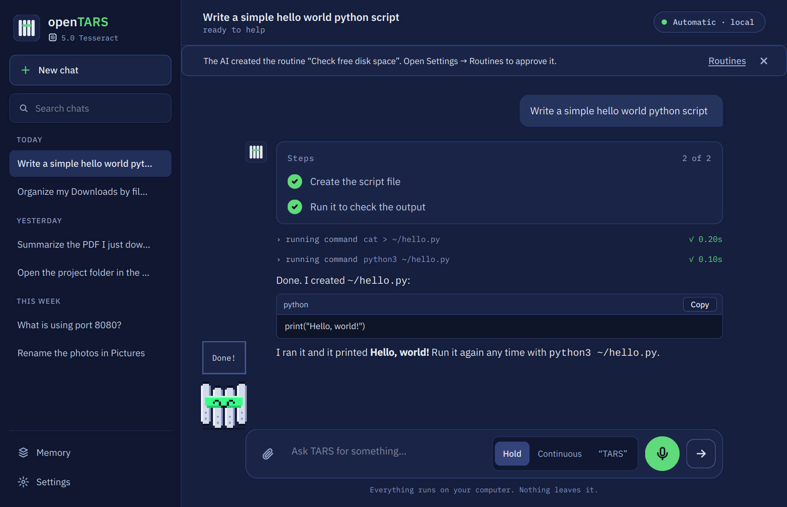

<sub>Screenshots are generated by <code>tests/gerar_capturas.py</code> from the real window. The model's replies in them are scripted so the images always look the same.</sub>

</div>

<br>

## Why openTARS

<table>
<tr>
<td width="50%" valign="top">

### It has its own AI
**Gargantua** was trained on thousands of requests that were actually solved inside openTARS and checked one by one. It already knows the tools: it opens, clicks, calculates and creates files on the first try, fast, on a 6 GB graphics card.

</td>
<td width="50%" valign="top">

### It picks the AI by itself
Several layers read each request in milliseconds, without spending any AI, and route it to the best of the models you already have: the one that sees the screen, the coding one, the general one or the fastest. "Thinking" is only switched on when it helps: opening and closing programs is instant.

</td>
</tr>
<tr>
<td width="50%" valign="top">

### Clicks by name, not by position
It presses buttons by the text they show ("7", "=", "Save") through Linux accessibility: no screenshot, no coordinates, in milliseconds, even on Wayland. A screenshot remains the plan B.

</td>
<td width="50%" valign="top">

### Stays on your PC
Nothing you type or show leaves your machine. Dangerous commands ask for confirmation, and it never closes a program with unsaved work.

</td>
</tr>
</table>

## What's new in 5.0 Tesseract

5.0 replaces the window with a new one built in **Qt (PySide6)**. The core underneath is the 4.6 one (Ollama only, Cooper looking at the screen) with **voice**, **attachments** and the **optional cloud** back.

<table>
<tr>
<td width="50%">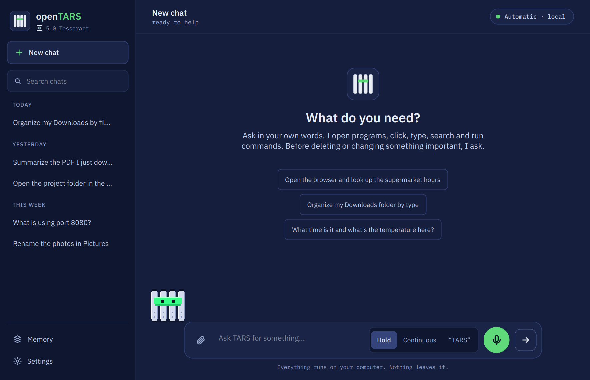</td>
<td width="50%">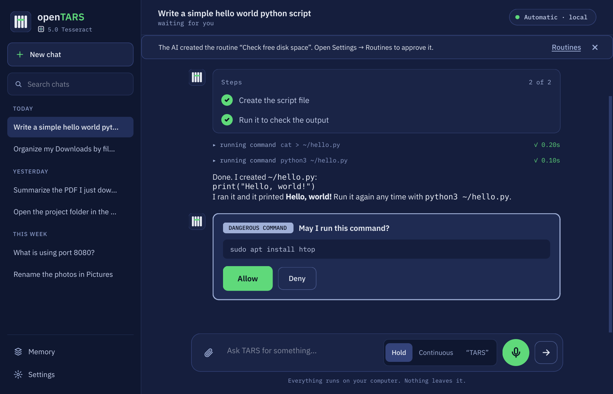</td>
</tr>
<tr>
<td align="center"><sub>Home: history by day, model pill, suggestions</sub></td>
<td align="center"><sub>Risky actions ask first: <b>Allow</b> / <b>Deny</b></sub></td>
</tr>
</table>

| | |
|---|---|
| 🧭 **First run** | 5 steps: language, Ollama, cloud (optional), downloading Gargantua and a quick test. It looks for Ollama, installs it if missing (asks for the system password), downloads the model with a progress bar (pause and resume) and checks it with a simple sum |
| 💬 **Main window** | Sidebar with the **history by day** (search, delete; opening a conversation gives the exact context back to the AI), model pill (Automatic, local or cloud), **Stop** button, bubbles, collapsed reasoning, tools with timings and notices. Shortcuts: `Ctrl+N` new chat, `Ctrl+K` search, `Ctrl+,` settings, `Ctrl+M` microphone, `Esc` stop |
| ✅ **Step list** | On long tasks, the **Steps** card shows what is left; each finished action ticks a step (an approximation: looking at the screen does not count) and everything closes at the end. When it needs you, it shows "waiting for you" |
| 🛡️ **Asks before risky actions** | A dangerous command becomes a card with **Allow** / **Deny** (3 lines and "Show all"). Stopping also denies whatever was waiting |
| 🎙️ **Voice, 3 modes** | **Hold** to talk, **Continuous** and the wake word **"TARS"**, all local (faster-whisper + Kokoro). English and Portuguese (the Portuguese voice is less natural than the English one). The voice screen has waves, "you said", mute and stop. Without the voice installed, the microphone takes you to **Settings → Voice** to install it |
| 📎 **Attachments** | Paperclip or drag files onto the window; text and images (images only for a model that can see) |
| 🧠 **Visible memory** | **Settings → Memory & privacy** lists what TARS remembers, forgets item by item, exports your chats and erases history/memory (with confirmation) |
| ☁️ **Cloud, only if you want it** | The default is **"No, only on my computer"**. If you want, use Ollama Cloud, Groq, Cerebras or any OpenAI-compatible address with **your own** key, stored only on this computer (mode 0600) and never displayed. A cloud model never enters the automatic choice; when you pick one, the footer warns that the text goes to the provider. *The Ollama Cloud address and the free limits are still "to be confirmed".* |
| 🔄 **Automatic update detection** | Upload a new `opentars_all.deb` to the repository and every installed copy notices it on its own: no release, tag or checksum file to maintain. See [Updates](#updates) |
| ⏰ **Scheduled routines** | **Settings → Routines**: "every day at 8, open the newspaper". Daily, weekdays, every N minutes (5 or more) or once. Each routine runs in its own chat (⏰ in the history), without speaking aloud, and records the result (done, stopped, unfinished). **It only runs while openTARS is open**: with routines on, closing the window leaves the app in the system tray (if your desktop has one). If the computer or the app was off at the time, the routine is **skipped** (more than 10 min late) and you are told. When you create one, you tick what it may do **without asking** (delete files, send/publish, install/change the system); anything else makes it **stop and tell you**, it never decides alone. A routine created by the AI in chat starts **disabled** until you approve it. (Gargantua does not know these tools, since it was trained on a fixed list; use the form.) Stored in `~/.config/opentars/agenda.json` |
| ⚡ **Quick bar in Qt** | `Ctrl+Alt+Space` (or `opentars-gui --rapido`): floating box, ask, answer in place, `Esc` closes, `Ctrl+Enter` opens the window. Follow-up questions continue the same chat; a risky action brings up the window with the Allow/Deny card. Opened only by the bar, it quits by itself after 30 min idle |
| 🔤 **Fonts included** | IBM Plex (OFL license) ships inside the package |
| 🛟 **Without Qt, everything still works** | If PySide6 is missing (or with `--tk`), the 4.6 window opens as before. `TARS_SEM_ASSISTENTE=1` skips the first-run assistant. With `--tk` the quick bar is the 4.6 one |
| 📦 **Package: .deb only** | 5.0 ships as a **.deb** (Ubuntu, Zorin, Mint, Debian, Pop!_OS). The AppImage was built and tested (~60 MB) but **left out of the delivery**; the recipe stays in `empacotamento/appimage/` for anyone who wants to build it (`sudo bash empacotamento/appimage/build.sh`) |
| 🔍 **Full code audit** | About 50 fixes across the core, the window, routines and the updater: atomic writes for every settings file (with `.corrompido` backups of broken ones), `rm` with wildcards, `find -exec rm`, `curl \| sh` and `ssh` now ask first, typing a dangerous command into a terminal asks too, the cloud key no longer leaks to child processes, a command that starts a background app no longer hangs the turn, an Ollama stream that ends without `done` is an error instead of a half answer, a routine never runs twice for the same slot, and more |

**Not in 5.0 yet:** Cooper improvement (needs GPU training, which cannot be done in the development environment; Cooper is still the 4.6 one), validation on a clean virtual machine and on Wayland, voice with a real microphone, and an end-to-end test of the update flow against the real GitHub repository.

### Settings

<table>
<tr>
<td width="50%">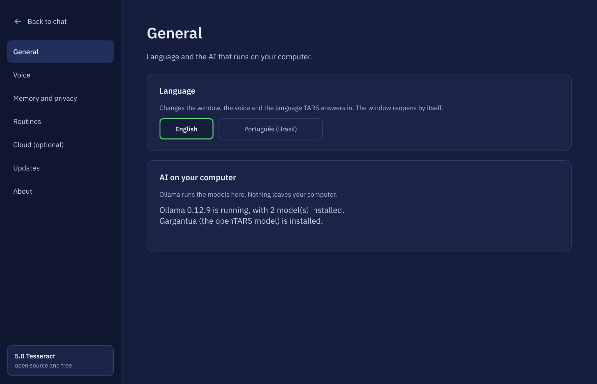</td>
<td width="50%">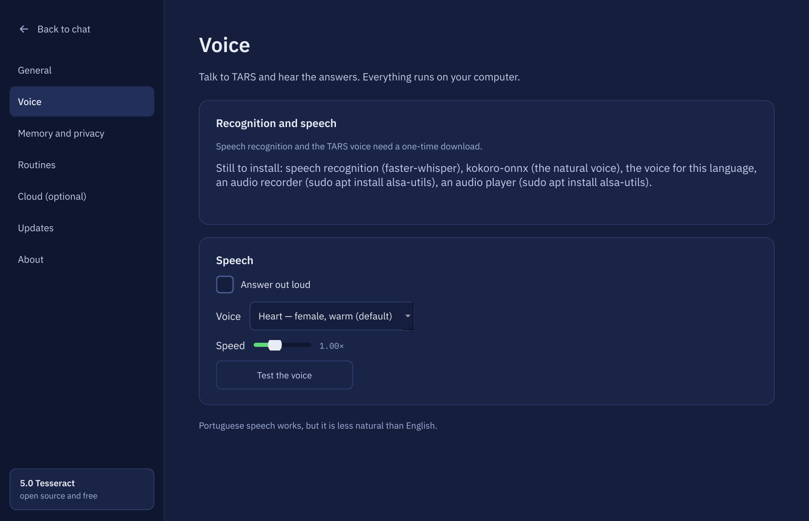</td>
</tr>
<tr>
<td width="50%">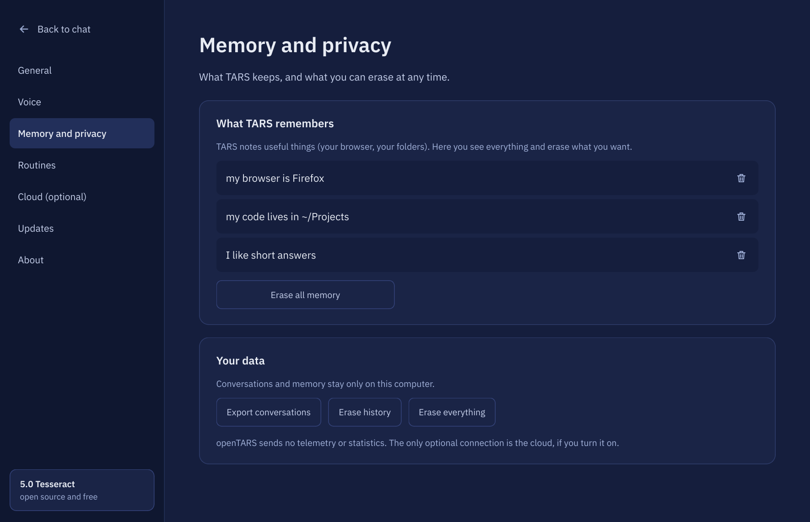</td>
<td width="50%">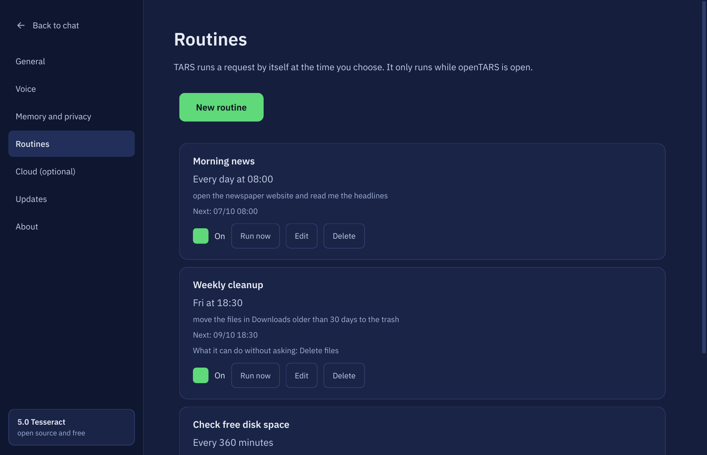</td>
</tr>
<tr>
<td width="50%">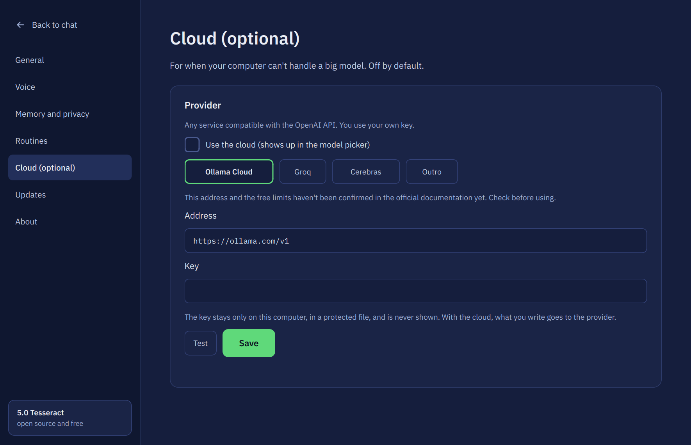</td>
<td width="50%">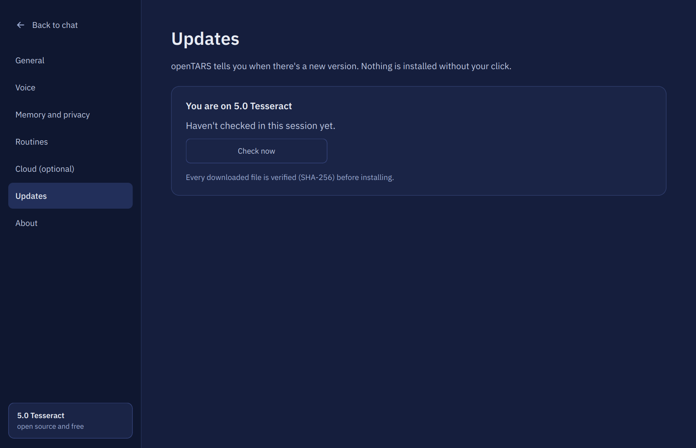</td>
</tr>
</table>

### Voice, quick bar and first run

<table>
<tr>
<td width="50%">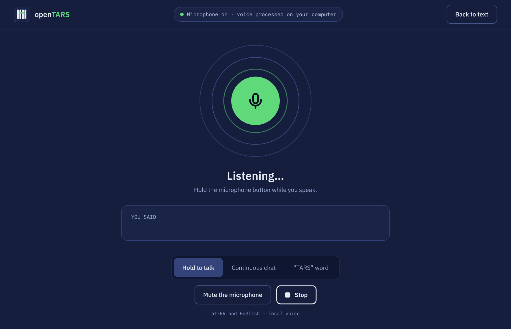</td>
<td width="50%">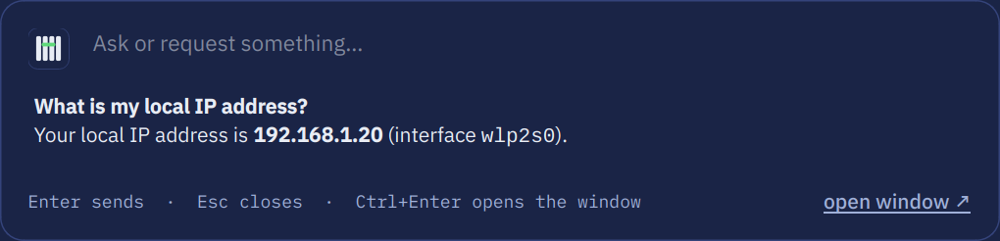</td>
</tr>
<tr>
<td width="33%">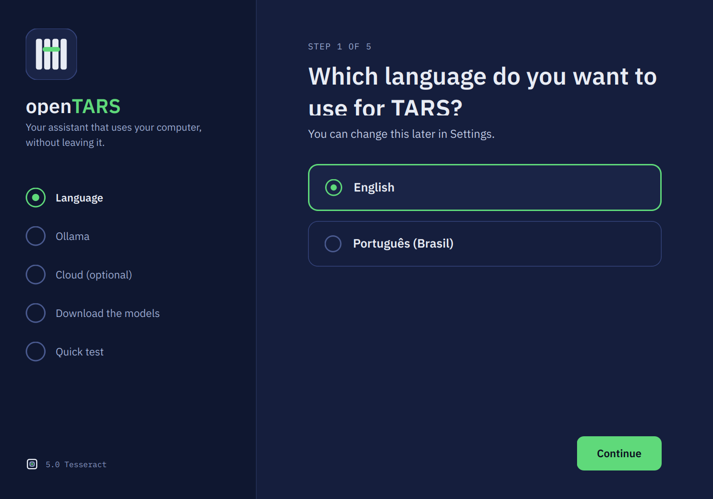</td>
<td width="33%">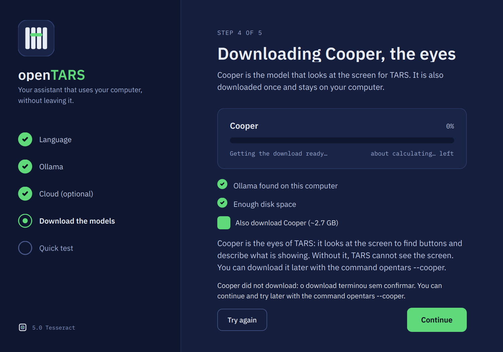</td>
</tr>
</table>

## Earlier releases

<details>
<summary><b>4.6 Endurance</b>: removed what was heavy and what Gargantua did not use</summary>

| | |
|---|---|
| ✂️ **Ollama only** | External servers (`--servidor`, `api:<name>`: vLLM, LM Studio, llama.cpp...) and `.gguf` import from other programs are gone. Models come from Ollama |
| 👁️ **Only Cooper looks at the screen** | OCR (`tesseract`), the zoom grid and the fallback vision model are gone. Clicking an icon without text: accessibility → Cooper. If Cooper fails or is not installed, the screen shows why instead of trying another path |
| 🧹 **Less dead code** | Unused functions and duplicated Portuguese/English command-line options were removed |
| 🧪 **Murph phrases out of the package** | `tars_exemplos*.py` (only used to train Murph) moved to `murph/` in the source |

Voice, attachments and scheduled routines were removed in 4.6 and came back in 5.0.
</details>

<details>
<summary><b>4.5 Endurance</b>: Cooper, WSL, no-GUI mode, attachments</summary>

| | |
|---|---|
| 👁️ **Cooper, the model that looks at the screen** | A Qwen3-VL 2B fine-tuned by the openTARS team to answer about a screenshot: **where** a button is, **what** a field says, which windows are open. Positions come in thousandths of the image (0 to 1000) and become pixels automatically. [Details](#cooper-the-model-that-looks-at-the-screen) |
| 🪟 **WSL** | Runs on WSL 1 and 2. With **WSLg** (Windows 11) the window opens normally; without it, it goes to the terminal. It finds the **Ollama running on Windows** by itself and opens links in the Windows browser |
| 🖥️ **Linux without a GUI** | Server, SSH, container: with no `DISPLAY`, openTARS becomes a terminal assistant. **`opentars --chat`** talks to the AI, runs commands and edits files. `TARS_SEM_INTERFACE=1` forces this mode |
| 🌱 **Everything on demand** | Nothing is loaded when openTARS opens. Cooper leaves memory 2 min after its last use and the chat model after 5 min |
| ✂️ **Lighter: 28 → 19 tools** | Trash, undo and clipboard modules are gone; `double_click` and `hotkey` were merged into `click_mouse` and `press_key`. `rm` really deletes (dangerous commands still ask); to trash, the AI uses `gio trash` |
| 🛠️ **General review** | 40+ fixes: **Stop** works while the model loads, real **right click**, unknown keys are errors, `close_application` no longer kills processes that only have the name in the path, and more |
</details>

<details>
<summary><b>4.0 Endurance / Neo</b>: Gargantua, Murph, update notice</summary>

| | |
|---|---|
| 🌀 **Gargantua, the official AI** | A Qwen3 4B trained to use openTARS. The installer downloads it (`ProjectOpenTARS/Gargantua`, ~2.5 GB) and AUTO mode uses it first for actions and searches |
| 🪪 **It knows its own name** | Ask "who are you?" and it answers that it is Gargantua, the AI of openTARS |
| 🧭 **Longer tasks** | A request with a plan starts with more steps and, while the AI makes real progress, it gets extra room (up to 120 steps). Old results are summarized so the AI's memory does not overflow mid-task |
| ⚡ **Short format** | Gargantua receives a small prompt, summarized tools and no "reasoning": it answers faster and leaves memory free on the card |
| 🧪 **Open training kit** | `gargantua/gargantua.py` collects examples on a virtual screen, trains on a 6 GB card and exports the GGUF. [Step-by-step tutorial](gargantua/TUTORIAL.md) |
| 📁 **Knows your folders** | The AI gets the real names of Desktop, Documents and Downloads (read from `user-dirs.dirs`) |
| 🪶 **Lighter (Neo)** | The embedding model, the old Naive Bayes classifier and the `qwen2.5:0.5b` helper are gone: **Murph**, keywords, context, format and your apps decide the request type |
</details>

## Cooper, the model that looks at the screen

```bash
ollama pull ProjectOpenTARS/cooper     # or: opentars --cooper
```

Cooper **does not chat or click**: it receives a screenshot and a question and answers about what it sees. With it installed, openTARS can:

- **find icons and buttons without text** ("click the gear icon"): it asks where the icon is, clicks that point, then checks that the screen changed, as always;
- **describe the screen** to an AI that cannot see, with the positions already in pixels.

`--diagnostico` shows whether it is installed. `TARS_COOPER=0` turns its use off (it stays installed). It never enters the AUTO choice of chat AI.

**Cooper is the only model that looks at the screen.** If it answers, the answer stands. If it fails (or is not installed), openTARS shows the reason and the AI is told to use `list_elements` and `click_element`. There is no fallback vision model.

> **First version:** Cooper was trained only on synthetic screens and has not been measured on real screens yet. That is why openTARS verifies the result of every click.

## Installation

For Ubuntu, Debian, Linux Mint, Zorin OS, Pop!_OS and derivatives. Paste in a terminal:

```bash
wget -O /tmp/opentars.deb https://github.com/project-opentars/openTars-lightweight-local-addon/raw/main/opentars_all.deb && sudo apt install -y --reinstall /tmp/opentars.deb
```

That single command installs **everything** openTARS needs, skipping what you already have:

- all system dependencies through apt (including accessibility, for clicking by name)
- Ollama (or uses the one already running, Docker included)
- an isolated Python environment (with PySide6 for the new window)
- **Gargantua (4.0)**, the official AI (~2.5 GB, `ProjectOpenTARS/Gargantua`), trained to use its tools. See [Gargantua](#gargantua-the-official-ai)
- **Cooper (4.5)**, optional (~2.7 GB, `ProjectOpenTARS/cooper`): the first-run window offers to download it right after Gargantua (ticked when both fit on the disk; untick it to skip, and if it fails or is paused you can still continue); the installer also asks when run in a terminal with a graphical session, and otherwise prints the command. `TARS_COM_COOPER=1` downloads without asking, `TARS_SEM_COOPER=1` skips it. See [Cooper](#cooper-the-model-that-looks-at-the-screen)
- **a chat model chosen for your hardware**, only if Gargantua was not downloaded and you have no other model yet: `qwen3:8b` with a 6 GB+ graphics card, `qwen3:4b` with 12 GB+ of RAM and `qwen3:1.7b` otherwise
- the application-menu shortcut

No helper model is downloaded: the type of each request is decided by the **Murph 1.0** helper, which ships in the package.

On first launch, a short assistant checks Ollama and the model for you (skip it with `TARS_SEM_ASSISTENTE=1`).

**WSL or a server without a GUI:** the same command works; to install only what the terminal needs, replace `apt install -y --reinstall` with `apt install -y --no-install-recommends --reinstall`. On WSL without systemd, start Ollama in another terminal (`ollama serve`) and run `opentars --setup` again; if your Ollama runs on Windows, set `OLLAMA_HOST=0.0.0.0` there (openTARS finds the address by itself). Then: `opentars --chat`.

The installer speaks your system language. To **update**, see [Updates](#updates) (or just run the same command): your chat history and choices are kept.

After installing, run `opentars --autoteste` once: it checks the environment and runs a real test (the AI opens the calculator and does 7 + 2), saving a report to `~/opentars-autoteste.txt`.

<details>
<summary>Want more models?</summary>

The more different models you have, the better openTARS can match the AI to the request. For it to **see the screen** (describe images, apps without accessibility), download a model with vision and tools:

```bash
ollama pull qwen3-vl:8b
```

To pick another chat model at install time, put `TARS_MODELO_CONVERSA=qwen3:14b` before `apt install` (e.g. `sudo TARS_MODELO_CONVERSA=qwen3:14b apt install -y --reinstall /tmp/opentars.deb`). To download none: `TARS_SEM_MODELO=1`. To skip Gargantua: `TARS_SEM_GARGANTUA=1`.

</details>

<details>
<summary>Prefer to download the file by hand?</summary>

Click [`opentars_all.deb`](https://github.com/project-opentars/openTars-lightweight-local-addon/raw/main/opentars_all.deb) and, in the folder where it was saved (usually `~/Downloads`):

```bash
sudo apt install -y --reinstall ./opentars_all.deb
```

</details>

## Updates

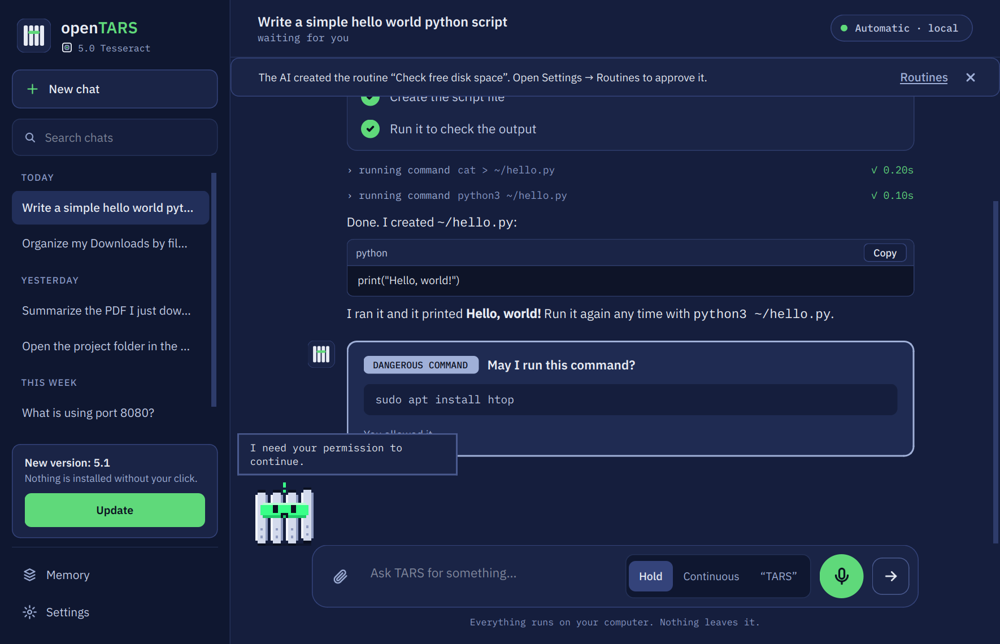

openTARS notices a new version **by itself**. There are no releases, tags or checksum files to maintain: it is enough to upload a new `opentars_all.deb` to the repository (GitHub's "Add files via upload" is fine).

- At most once a day (and on **Settings → Updates → Check now**), it asks GitHub's public API for the files at the root of the repository and for the date of the last commit that touched `opentars_all.deb`.
- If that upload is **newer than the installed package** (compared with the build time of the package) and is not the file you already installed, a notice appears in the sidebar.
- **Update** downloads the file, **verifies it** (the git blob hash that GitHub itself reports for the file) and installs it through the system's authentication prompt (`pkexec` + `apt`). The download goes to a root-owned temporary folder and is verified again right before installing.
- It only talks to GitHub domains (`github.com`, `api.github.com`, `raw.githubusercontent.com`). Nothing is sent from your PC besides the request itself.
- If the repository has a regular GitHub Release with a `.deb` and a `SHA256SUMS` file, that is also understood and verified with SHA-256.
- Whatever you installed is remembered in `~/.config/opentars/atualizacao.json`, so you are never told to update to the file you already have.
- `TARS_SEM_AVISO_VERSAO=1` turns the whole check off.

<br clear="right">

## Gargantua, the official AI

**Gargantua** is the AI made for openTARS: a Qwen3 4B trained on thousands of requests actually solved inside openTARS (opening and closing apps, calculator, folders and files, searches, text editor, memory, refusing dangerous commands). Only conversations approved by an automatic checker went into training: the calculator display showed the right sum, the folder existed, nothing was deleted.

```bash
ollama pull ProjectOpenTARS/Gargantua
```

The installer already does this. With it:

- **For actions and searches, AUTO mode uses Gargantua first.** To chat, code or explain, the queue still picks the best model you have. If it fails a lot on your PC, the success scoreboard sends it to the back of the queue, like any other.
- **Short format.** Since it learned the rules during training, it gets a small prompt, tools with one-sentence descriptions and no "reasoning": it answers faster and fits on a 4–6 GB card.
- **To pick it by hand:** `/modelo gargantua` (or the AI selector in the window).
- **To check it is installed:** `opentars --version` or `opentars --diagnostico`.
- **To turn the preference off:** `TARS_SEM_GARGANTUA=1`.

| | Gargantua | A regular model (e.g. `qwen3:4b`) |
|---|---|---|
| System prompt + tools | ~1,200 tokens | ~4,000 tokens |
| Reasoning before acting | not needed | turns on for hard requests |
| Learned openTARS's tools | yes, with checked examples | no, only reads the instructions |

**Want to train your own?** The kit (`gargantua/gargantua.py`) collects examples on a virtual screen, trains with Unsloth on a 6 GB card and exports the GGUF, all on your PC. Any model with "gargantua" in its name is treated as it. See the **[training kit tutorial](gargantua/TUTORIAL.md)**.

## How it works

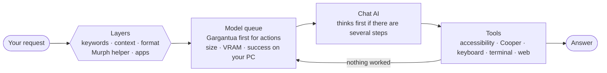

### 1. Several layers decide the request type

Each layer looks at the request in its own way and casts votes. When one of them is clear, the others do not even need to run:

| Layer | What it looks at | Example |
|---|---|---|
| **Keywords** | an explicit verb or target | "**close** Firefox" → action, instantly |
| **Context** | continuation of the previous request | "now click =" after opening the calculator → action |
| **Format** | pasted code, an error, a command, a link, a question, a greeting | a `Traceback` → code; `E: dpkg...` → Linux/system |
| **Murph 1.0 helper** | the local helper that ships in the package (shown in the window's status bar and in `opentars --version`): a small model trained on ~2,900 phrases in 5 languages (openTARS's own examples plus new phrases written by a large model, the TinyStories recipe). Runs in ~0.2 ms, without Ollama. In a blind test with messy requests it had never seen, it got 93% alone (the old classifier, removed in Neo: 84%); when it says it is sure, it is right 99% of the time. When in doubt, the two most likely get a small vote and the apps break the tie | "turn the sound down a bit" → action |
| **Apps** | mentions an installed app | "spotify is muted" → action |
| **Coherence** | fixes nonsensical results | "simple chat" on a 20-word request → general |

The layer also detects **multi-step requests** ("open Claude **and** ask a question"). For these, the AI thinks before acting, gets a reminder to do everything and the request goes to the largest model that runs well on your PC.

To see the reasoning for a request, layer by layer, and the model queue:

```bash
opentars --explicar "open claude and ask a simple question"
```

### 2. The model queue learns from your PC

openTARS chooses among the models you have by size and by what fits in VRAM. For actions and searches, **Gargantua** goes first (if it runs well on your PC). Coding specialists (`qwen2.5-coder` and similar) **only** handle code. It also records, per task, whether each model succeeded or failed recently: a model that fails most of the time on a task drops in the queue **for that** task, and climbs back if it starts succeeding.

### 3. The AI works with a safety net

- **Malformed calls are repaired:** `open_app` becomes `open_application`, `app_name` becomes `app`, `"120"` becomes `120`.
- **"Done!" without doing anything is challenged:** if the AI says it opened, clicked or sent something without calling the tool, or right after one failed, it is told to really do it (or say what went wrong).
- **It knows what is open:** on an action request it receives the list of open windows and which one has focus.
- **It does not walk in circles:**
  - repeating exactly what already failed is not even run again;
  - 3 failures of the same tool: it is told to change strategy;
  - 8 failures in a row: the next model in the queue takes over the same conversation, seeing what already failed.
- **A model that breaks or refuses hands the request on:** out of memory, an Ollama error or an insistent "I can't" send the request to the next model in the queue.
- **Tools per task:** a search receives only search tools, and small models make far fewer mistakes with fewer options. If needed, it gets them all.
- **Stream guard:** an Ollama stream that ends without `done` is treated as an error, never shown as a half answer.

### 4. Apps without accessibility work too

Clicking by name tries, in this order:

1. **Accessibility:** presses the button by name, with no mouse and no screenshot (GTK, Qt, Firefox, LibreOffice apps...).
2. **Cooper:** an icon without text ("send icon")? Cooper looks at the screenshot and says where it is; openTARS clicks the point and checks that the screen changed.
3. **Keyboard:** with none of the above, the AI types into the field that has focus.

#### Precise mouse

- **Real dragging:** `drag_mouse` holds the button, leaves slowly (Chrome/Brave only understand a drag after a few pixels) and drops at the destination: a place on the screen ("top-left", "right", "center", "left half"), another element ("Trash") or a point. The source can be described ("YouTube tab"): openTARS finds it by itself.
- **Aim:** `click_mouse` receives what you want to click (`target="X of the YouTube tab"`). The coordinate the AI guesses is usually off by 10–40 px; with Cooper installed it points to the exact spot (only accepted if close to the guess). Without it, a click that landed beside a button snaps to it.
- **Real window moves:** "drag the openTARS window to the top left", "put Firefox on the right half", "maximize the terminal": openTARS asks the window manager (`move_window`) instead of dragging what is written inside the window.
- **It checks the click:** it compares the screen before and after. If nothing changed, the AI hears "the click MISSED" instead of claiming it worked.

Electron apps (Claude, Discord, VS Code...) opened **by openTARS** start with accessibility on, so clicking by name works on them directly.

### 5. Plans and checks

A multi-step request ("open gmail and then spotify") becomes a numbered **plan**, shown on screen and sent to the AI. If it tries to finish before doing every step, the plan is handed back with what is missing. A click that changed nothing followed by "Done!" is challenged, and repeated clicks on nothing count as walking in circles: another model takes over or the AI explains what got stuck.

### 6. Memory

"Remember my browser is Brave", "my projects folder is ~/dev". It applies to every conversation from then on; "forget the Brave one" deletes it. Stored in `~/.config/opentars/memoria.json` and listed in **Settings → Memory & privacy**.

### 7. Wayland

- **Real Wayland (experimental):** with `ydotool` 1.0+ and the `ydotoold` service running, mouse and keyboard reach any window, not only XWayland ones. Keep mouse acceleration off for better precision.

### 8. One conversation

All models share the same conversation: switching AI midway does not make it forget what you asked before. When a request passes from Gargantua to another model (or back), the format switches with it.

## Usage

Open **openTARS** from the application menu, or run `opentars-gui`. Without a GUI (server, SSH, WSL): `opentars --chat`. Running plain `opentars` in a terminal shows the openTARS logo and opens the chat right there (the same as `opentars --chat`). In a script or a pipe it only checks that your environment is healthy, like `opentars --diagnostico`.


The home screen offers four suggestions to click (in your language), one for each kind of thing it does:

| Suggestion | What it shows |
|---|---|
| Open the calculator and do 12 × 8 with the buttons | clicks buttons by name |
| Which windows are open right now? | sees what is open |
| Search YouTube for lasagna recipe videos | searches the web |
| How much memory and disk am I using? | reads the PC's state |

More examples: `close spotify and open discord`, `what is on my screen?`, `how do I see my IP on linux?`.

### Code with a copy button

Ask for a script, a function or a command and the code arrives in its own box, with the language on top and a **Copy** button (copies only the code), like Claude and ChatGPT. Coding requests go to your coding specialist model if you have one (`qwen2.5-coder`, `codestral`, `deepseek-coder`...).


### Quick bar: `Ctrl+Alt+Space`

Press `Ctrl+Alt+Space` from anywhere and ask without switching windows. The answer shows up in the bar itself; `Esc` closes, `Ctrl+Enter` opens the full window.


The shortcut is registered by itself the first time you open openTARS (GNOME, Zorin, Ubuntu, Cinnamon, MATE and XFCE), without stepping on shortcuts you already use. It appears in Settings > Keyboard > Shortcuts, and you can change it there or like this:

```bash
opentars --atalho ctrl+alt+o     # another combination
opentars --atalho off            # remove
```

On KDE and other environments, register by hand a shortcut running `opentars-gui --rapido`.

### Controls

| In the window | Or type | What it does |
|---|---|---|
| **Stop** or `Esc` | | interrupts the answer or task immediately |
| `↑` / `↓` | | repeats previous requests |
| **AI** selector at the top | `/modelo <name>` · `/modelo auto` | pins a model or goes back to automatic |
| language menu at the top | `/idioma <code>` | changes the language |
| **New chat** (`Ctrl+N`) | `/limpar` | starts from scratch (the conversation stays saved between uses) |

Other commands:

| Command | What it does |
|---|---|
| `opentars` | shows the logo and opens the chat in the terminal (in a script or a pipe, it checks the setup instead) |
| `opentars-gui` | opens the window |
| `opentars-gui --rapido` | opens the quick bar |
| `opentars --chat` | chats in the terminal (WSL, SSH, no graphical session) |
| `opentars --chat "request"` | answers one request in the terminal and exits |
| `opentars --idioma <code>` | changes the language (`pt_BR` or `en`) |
| `opentars --atalho [keys\|off]` | shows, changes or removes the global shortcut |
| `opentars --cooper` | downloads Cooper, the model that looks at the screen |
| `opentars --diagnostico` | checks Ollama, models, GPU, screen, windows, accessibility and shortcut (changes nothing) |
| `opentars --autoteste` | diagnosis + task-choice accuracy + the real calculator test |
| `opentars --avaliar-classificador` | measures how well each layer (and AUTO mode) does on your PC |
| `opentars --explicar "request"` | shows, layer by layer, how the task and the model are chosen |
| `opentars --setup` | installs whatever is missing (Ollama, models...) |
| `opentars --version` | shows the version |
| `opentars --help` | all commands |

## Languages

The window, the command line, the installer and the application menu speak **English and Portuguese (pt-BR)**. Switch in the menu at the top of the window (or with `/idioma en` / `opentars --idioma pt_BR`); the choice is saved. With no choice, the system language applies (English if the system is in another language).

The AI answers in the chosen language. Spanish, French and German left the interface; requests written in them are still usually understood (the Murph helper learned from phrases in 5 languages), but the answer comes in English or Portuguese.

**Want openTARS in your language?** All texts live in `idiomas/<code>.json`. Copy `en.json`, translate the values and save it as, for example, `it.json`: the new language shows up in the menu by itself, with no code changes. Send a pull request!

## Compatibility

| | Works | Notes |
|---|---|---|
| **Distros** | Ubuntu 22.04+, Debian 12+, Mint, Zorin, Pop!_OS and derivatives | needs `apt` |
| **Desktop** | GNOME, KDE, Cinnamon, XFCE, MATE and others | menu apps, Snap and Flatpak, by name in any language |
| **Xorg (X11) session** | everything | |
| **Wayland session** | chat, opening apps and sites, commands, screenshots and **clicking by name** | click and typing by coordinate only reach some apps (a Wayland limitation); not yet validated on a clean install |
| **Click by name** | GTK (GNOME), Qt/KDE, Firefox, LibreOffice apps and, by reading the screen, any app that shows text (Electron, games, Java) | icon without text: needs a vision model (e.g. `qwen3-vl:8b`) or Cooper; clicking by reading the screen needs an X11 session |
| **GPU** | NVIDIA, AMD or CPU only | without a GPU, automatic mode avoids models that are too large |
| **Gargantua** | card with ~3 GB free, or CPU with 8 GB of RAM | it works on CPU, only slower; training your own needs an NVIDIA card with 6 GB |
| **Ollama** | local, Docker or another machine | another address: `OLLAMA_HOST` variable |
| **WSL 1 and 2** | terminal chat (`opentars --chat`), commands, files; window and screenshots with WSLg | Ollama can be on Windows (found by itself; there, `OLLAMA_HOST=0.0.0.0`) or inside WSL. Without systemd: `ollama serve` in another terminal |
| **No GUI** | `opentars --chat`: chat, commands, files, search (returns the link) | no mouse, keyboard, windows, screenshots or opening graphical programs |
| **Cooper** | optional, ~2.7 GB (`ollama pull ProjectOpenTARS/cooper`) | only useful with a screen; needs Ollama 0.12.7 or newer |
| **Qt window** | needs PySide6 (installed in the package's own environment) | without it, the 4.6 Tkinter window opens |

## Security and privacy

- Everything runs locally. openTARS sends data to no server. Its only own connections are the update check (read-only requests to GitHub) and the cloud provider **if you chose to enable one**.
- Commands that delete data or change the system (`rm -r`, `rm` with wildcards, `find -exec rm`, `mkfs`, `dd`, `git reset --hard`, `curl | sh`, `ssh`, shutting down the PC...) only run after your confirmation. Typing such a command into a terminal window is covered too.
- Routines never decide alone: a risky command inside a routine passes only if you pre-approved that category (delete / send / install) when creating it; otherwise the routine stops and tells you.
- Cloud keys are stored only on this computer (file mode 0600), never displayed, never written to the log, and not passed to the commands the AI runs.
- The log keeps only the length of text typed on your behalf, not the text itself, and the log folder is private (0700).
- Commands that ask for a password (`sudo`) do not hang: they fail at once, and the AI shows you the command to run yourself. (Risky `sudo` commands still go through the Allow/Deny card first.)
- Closing a program is like clicking the X: if it asks "save changes?", openTARS does not force it.
- For clicking by name, openTARS turns on the session's accessibility (the same one a screen reader uses) only when needed, and it returns to normal when the session ends.
- Vision (Cooper) runs on your PC like everything else.
- Settings files (`agenda.json`, `nuvem.json`, history, memory, update state) are written atomically; a broken file is kept as `*.corrompido` instead of being lost.
- The models' success history is in `~/.cache/opentars/historico_modelos.json` (delete it to reset).
- Everything it runs is recorded in `~/.tars_log/tars.log`; Qt problems go to `~/.tars_log/qt.log`.

<details>
<summary><b>Advanced configuration</b> (environment variables)</summary>

| Variable | What for | Default |
|---|---|---|
| `OLLAMA_HOST` | Ollama address | `127.0.0.1:11434` |
| `TARS_SEM_GARGANTUA=1` | does not download Gargantua at install and AUTO gives it no preference | Gargantua on |
| `TARS_MODELO_GARGANTUA` | another name for Gargantua (e.g. one you trained) | `ProjectOpenTARS/Gargantua` |
| `TARS_YDOTOOL=0` | does not use ydotool on Wayland | on if available |
| `TARS_MURPH=off` | turns Murph off (only keywords, context, format and apps decide), for comparison | Murph on |
| `TARS_SEM_AVISO_VERSAO=1` | does not check for a new version | checks once a day |
| `TARS_ARQUIVO_ATUALIZACAO` | where the installed-update state is kept | `~/.config/opentars/atualizacao.json` |
| `TARS_ARQUIVO_AGENDA` | where the routines are kept | `~/.config/opentars/agenda.json` |
| `TARS_SEM_ASSISTENTE=1` | skips the first-run assistant | assistant on |
| `TARS_SEM_QT=1` | uses the Tkinter window even if PySide6 is installed | Qt on |
| `TARS_LIMITE_ETAPAS` | ceiling of steps for a long request (extra room stops here) | `120` |
| `TARS_WHISPER_DISPOSITIVO` | where Whisper runs: `auto`, `cuda` or `cpu` | `auto` |
| `TARS_PENSAR` | `sempre` or `nunca` forces the AI's reasoning | automatic, by request type |
| `TARS_IDIOMA` | language for this run only, not saved | the one chosen in the menu |
| `TARS_CONTEXTO` | the AI's memory, in tokens | 16384 with a 16 GB+ GPU, else 8192 |
| `TARS_KEEP_ALIVE` | how long the chat model stays in memory after last use (`30s`, `5m`, `1h`, `0` = unload now) | `5m` |
| `TARS_KEEP_ALIVE_VISAO` | the same for Cooper and models that only describe screenshots | `2m` |
| `TARS_KEEP_ALIVE_AJUDANTE` | the same for the light background AI | `2m` |
| `TARS_PRECARGA=1` | loads the helper and Cooper at start (strong PC, faster first request) | off |
| `TARS_LARGURA_SCREENSHOT` | maximum width of the screenshot sent to the AI | 1280 |
| `TARS_SEM_ACESSIBILIDADE=1` | turns off clicking by name | on |
| `TARS_CLIQUE_POR_VISAO=0` | does not use the vision model to find icons without text | on |
| `TARS_CONTEXTO_JANELAS=0` | does not tell the AI which windows are open | on |
| `TARS_OCIOSO_MIN` | minutes the quick bar stays ready in the background | 30 |
| `TARS_SEM_CONFIRMACAO_PERIGOSOS=1` | does not ask to confirm dangerous commands (at your own risk) | off |

Example: `TARS_CONTEXTO=32768 opentars-gui`

</details>

## Troubleshooting

<details>
<summary><b>The window closed by itself after I sent a request</b></summary>

Open `~/.tars_log/qt.log` (Qt writes its warnings and errors there) and `~/.tars_log/tars.log`, and send both with the exact steps. As a workaround, `opentars-gui --tk` opens the previous Tkinter window.
</details>

<details>
<summary><b>It says there is no update, but I uploaded a new file</b></summary>

An update is only offered when the uploaded `opentars_all.deb` is newer than the build time of the package you have installed. Install the current file once (`sudo apt install -y --reinstall ./opentars_all.deb`), then upload the next one and use **Settings → Updates → Check now**. Behind a proxy or offline the check just says you are up to date.
</details>

<details>
<summary><b>Gargantua does not show up or is not used</b></summary>

- `opentars --version` says whether it is installed. If not: `ollama pull ProjectOpenTARS/Gargantua` (the install may have been offline).
- It only goes first on **actions and searches**. Chat, code and technical questions still go to the largest model that runs well.
- If the graphics card cannot hold it (under ~3 GB free), a smaller model may go ahead. Close programs that use the card.
- If it failed a lot on one kind of request on your PC, the scoreboard sends it to the back of that kind's queue. `opentars --explicar "the request"` shows the scoreboard. Delete `~/.cache/opentars/historico_modelos.json` to reset.
- Check that `TARS_SEM_GARGANTUA` is not set in your environment.
</details>

<details>
<summary><b>The AI says it "can't" open or close a program</b></summary>

openTARS reminds it of its tools and, if it refuses again, passes the request to the next model. Coding-only models such as `qwen2.5-coder` are never chosen to control the desktop in automatic mode. If you pinned one in the **AI** selector, go back to **Automatic**. The best one to control the PC is Gargantua: `ollama pull ProjectOpenTARS/Gargantua`.
</details>

<details>
<summary><b>Clicking by name does not find an app's buttons</b></summary>

When the app does not expose its buttons to accessibility, openTARS asks Cooper to find the spot. If even that does not work, check:

- **Is it an icon without text?** Install Cooper (`opentars --cooper`) and describe the icon ("click the send icon").
- **Is it an Electron app** (Claude, Discord, VS Code...) that was already open? Close it and ask openTARS to open it: when opened by it, the app starts with accessibility on.
- **Wayland session?** Clicking by vision needs X11. On the login screen, choose "Ubuntu on Xorg" (or equivalent).
- Run `opentars --diagnostico` and look at the "Click by name" line. Qt/KDE apps start to appear after the first time openTARS uses accessibility (reopen the app).
</details>

<details>
<summary><b>"Multimodal data provided, but model does not support multimodal requests"</b></summary>

When the chat model cannot see images (qwen3, llama...), the screenshot is not sent to it: Cooper describes the screen in text. If it is not installed, the AI reads the buttons through accessibility (`list_elements`). To get the description, run `opentars --cooper`.
</details>

<details>
<summary><b>The Ctrl+Alt+Space shortcut does nothing</b></summary>

Run `opentars --atalho` to see the situation. If the combination was already used by something else, choose another (`opentars --atalho ctrl+alt+o`). On KDE, register the command `opentars-gui --rapido` by hand.
</details>

<details>
<summary><b>Clicks by position and typing do nothing</b></summary>

The session is probably Wayland. Clicking by name works; for the rest, on the login screen click the gear and choose the option with "Xorg" in its name (on Ubuntu, "Ubuntu on Xorg").
</details>

<details>
<summary><b>"Ollama offline" at the top of the window</b></summary>

Start the service with `sudo systemctl start ollama`. If it runs in Docker or on another machine, set `OLLAMA_HOST` (e.g. `export OLLAMA_HOST=192.168.0.10:11434`).
</details>

<details>
<summary><b>The AI picks a strange model for a request</b></summary>

Run `opentars --explicar "your request"`: it shows what each layer thought, the decided task, the model queue and each model's scoreboard on your PC.

To measure overall accuracy, use `opentars --avaliar-classificador`: it shows how often Murph is right alone, how often AUTO mode is right with all layers together and which phrases it gets wrong. The examples for each request type live in `murph/tars_exemplos.py` and `murph/tars_exemplos_mais.py` (source code only; not in the .deb): adding a real phrase that landed in the wrong place already fixes similar cases (Murph learns from them when retrained: `python3 murph/treinar_murph.py`, which needs scikit-learn). To see how it behaves without Murph: `TARS_MURPH=off opentars --avaliar-classificador`. You can also pin a model in the window's **AI** selector.
</details>

<details>
<summary><b>The AI forgets the request mid-task or the answer is cut off</b></summary>

Not enough context memory. Raise it with `TARS_CONTEXTO` (uses more VRAM).
</details>

<details>
<summary><b>Error <code>E: Unsupported file ... given on commandline</code></b></summary>

The file is not in the current folder. Go to the folder where it was downloaded (`cd ~/Downloads`) or use the `wget` command from the installation.
</details>

<details>
<summary><b>Other</b></summary>

- **Ollama did not install** (no internet at the time): install it from [ollama.com/download](https://ollama.com/download) and run `opentars --setup`.
- **The graphical window does not open**: `sudo apt install python3-tk` and then `opentars --setup`.
- **Need help?** Run `opentars --autoteste` and send the file `~/opentars-autoteste.txt`.
</details>

## Uninstall

```bash
opentars --atalho off     # optional: removes the global shortcut
sudo apt remove opentars
```

Ollama, the downloaded models and your data (`~/.tars_sessoes.json`, `~/.tars_log/`, `~/.config/opentars/`, `~/.cache/opentars/`) are kept.

## For developers

```
tars.py                 start of the core: graphical session, configuration, and loads the parts of nucleo/
nucleo/                 the core in parts (registro, ollama, hardware, aplicacoes, controle, janelas, cooper,
                        elementos, ferramentas, rotinas, selecao, prompt, chat, nuvem, anexos, memoria,
                        utilidades, gargantua, voz, terminal), all in the same namespace:
                        tars.<name> remains valid for everything
nucleo/rotinas.py       5.0: schedule_task / list_tasks / delete_task (only offered on routine requests)
nucleo/cooper.py        4.5: Cooper in icon clicking and screen description
nucleo/gargantua.py     4.0: Gargantua's short format (identical to training) and its AUTO preference
gargantua/              Gargantua training kit (virtual-screen collection, QLoRA, GGUF, proof);
                        start with gargantua/TUTORIAL.md
tars_qt/                5.0: the Qt window (principal, conversa, configuracoes, barra_rapida, tela_voz, primeiro_uso, tema, ponte)
tars_gui.py             the 4.6 window (Tkinter, `--tk`), uses tars.py underneath
tars_historico.py       5.0: chat history (by day, search, export)
tars_primeiro_uso.py    5.0: first-run and cloud logic (no Qt)
tars_openai.py          5.0: talks to OpenAI-compatible servers (cloud)
tars_voz.py             5.0: voice (local recognition and speech)
tars_anexos.py          5.0: file attachments
tars_rotinas.py         5.0: scheduled routines (schedule, times, pre-approval; pure)
tars_atualizacao.py     5.0: update detection by repository upload, verified download, install via pkexec
tars_i18n.py            languages: loads idiomas/*.json and stores the choice
tars_acessibilidade.py  click by name (AT-SPI)
tars_escolha.py         task-choice layers, multi-step requests, model history
tars_murph.py           Murph (3.0.4): decides the request type; the model lives in modelos/murph.json
murph/                  Murph training (not in the package): generated phrases, treinar_murph.py, comparar.py
tars_mouse.py           precise mouse: drag, screen places, snap to button, checks the screen changed
tars_memoria.py         preference memory
tars_ambiente.py        4.5: WSL, no GUI, Windows paths, Windows Ollama (pure)
tars_cooper.py          4.5: Cooper questions in the training format, answer parsing, thousandths -> pixels (pure)
tars_wayland.py         mouse and keyboard through ydotool on Wayland
tars_atalho.py          global shortcut (GNOME, Cinnamon, MATE, XFCE)
tars_instancia.py       single instance (the bar opens instantly)
tars_autoteste.py       --diagnostico and --autoteste
idiomas/                one file per language: all texts
tests/                  tests (window and accessibility ones really run on an Xvfb, with the GNOME calculator)
tests/gerar_capturas.py regenerates docs/img/*.png from the real window (offscreen)
docs/img/               the screenshots used in this README
empacotamento/          everything that becomes the .deb (setup.sh, launchers, shortcut templates, icon, Debian scripts)
logo.svg                the logo
```

```bash
python3 tars.py                 # diagnosis and command-line options (needs requests, psutil, pyautogui, pillow, python3-tk and python3-gi)
python3 -m tars_qt              # Qt window (5.0)
python3 tars_gui.py             # 4.6 window (Tkinter)
cd tests && python3 run_all.py  # tests (Qt ones need an interpreter with PySide6; otherwise they are skipped)
python3 tests/gerar_capturas.py # regenerates the README screenshots
bash empacotamento/build.sh     # builds the .deb into dist/
```

The version lives in the `VERSAO` and `CODINOME` constants of `tars.py` (`build.sh` reads them from there) and at the top of `empacotamento/doc/changelog`. `REVISAO` (YYYYMMDDNN) is a sanity number; **update detection compares upload time with the package's build time, not versions**, so shipping a new build is just uploading the new `opentars_all.deb`.

**Mind Gargantua's format:** `SISTEMA_GARGANTUA`, `DESCRICOES_CURTAS`, `contexto_sistema()` and the tools are exactly what it saw in training. `tests/test_gargantua_v40.py` compares openTARS against the kit byte by byte; changing any of them requires new training.

## Follow along

News, behind the scenes and what is coming: **[@open.tars on Instagram](https://www.instagram.com/open.tars/)**.

## License

[MIT](LICENSE): you may use, copy, modify and distribute openTARS, including in other projects, as long as you keep the copyright notice and license with it. The software is provided "as is", without warranty.
